 

This is the entry point to **5G-MAG's Technical Documentation**. It includes resources related to specification analysis and implementation, explainers and reports, videos,...

[Download an overview about 5G-MAG](./docs/5G_MAG_Overview.pdf){: .btn .btn-blue }

---

# What is 5G-MAG currently working on?

<table>
  <tr>
    <td markdown="span" align="center" width="33%"><a href="./pages/streaming.html"><a/></td>
    <td markdown="span" align="center" width="33%"><a href="./pages/5gbroadcast.html"><a/></td>
    <td markdown="span" align="center" width="33%"><a href="./pages/multicastbroadcast.html"><a/></td>
  </tr>
  <tr>
    <td markdown="span" align="center" width="33%">[Streaming, Media Delivery and Data Analytics](./pages/streaming.html){: .btn .btn-blue } [Execution Plan](https://github.com/orgs/5G-MAG/projects/44/views/9){: .btn .btn-blue }</td>
    <td markdown="span" align="center" width="33%">[5G Broadcast for TV, Radio and Emergency Alerts](./pages/5gbroadcast.html){: .btn .btn-blue } [Execution Plan](https://github.com/orgs/5G-MAG/projects/44/views/10){: .btn .btn-blue }</td>
    <td markdown="span" align="center" width="33%">[Multicast and Broadcast Services in 5G Networks](./pages/multicastbroadcast.html){: .btn .btn-blue } [Execution Plan](https://github.com/orgs/5G-MAG/projects/44/views/11){: .btn .btn-blue }</td>
  </tr>
    <td> </td><td> </td><td> </td>
  <tr>
    <td markdown="span" align="center" width="33%"><a href="./pages/xr.html"><a/></td>
    <td markdown="span" align="center" width="33%"><a href="./pages/volumetric.html"><a/></td>
    <td markdown="span" align="center" width="33%"><a href="./pages/npn.html"><a/></td>
  </tr>
  <tr>
    <td markdown="span" align="center" width="33%">[XR: 3D Scenes and Avatar Communications](./pages/xr.html){: .btn .btn-blue } [Execution Plan](https://github.com/orgs/5G-MAG/projects/44/views/12){: .btn .btn-blue }</td>
    <td markdown="span" align="center" width="33%">[Volumetric Video and Beyond 2D Video Experiences](./pages/volumetric.html){: .btn .btn-blue } [Execution Plan](https://github.com/orgs/5G-MAG/projects/44/views/13){: .btn .btn-blue }</td>
    <td markdown="span" align="center" width="33%">[Non-Public Networks for Content Production](./pages/npn.html){: .btn .btn-blue } [Execution Plan](https://github.com/orgs/5G-MAG/projects/44/views/14){: .btn .btn-blue }</td>
  </tr>
    <td> </td><td> </td><td> </td>
  <tr>
    <td markdown="span" align="center" width="33%"><a href="./pages/api.html">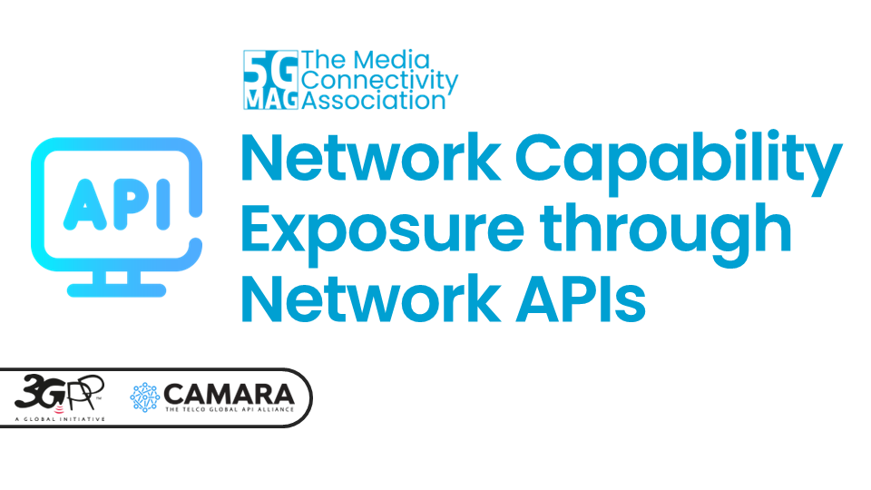<a/></td>
    <td markdown="span" align="center" width="33%"><a href="./pages/ntn.html"><a/></td>
    <td markdown="span" align="center" width="33%"><a href="./pages/6g.html"><a/></td>
  </tr>
  <tr>
    <td markdown="span" align="center" width="33%">[Network Capability Exposure through Network APIs](./pages/api.html){: .btn .btn-blue } [Execution Plan](https://github.com/orgs/5G-MAG/projects/44/views/15){: .btn .btn-blue }</td>
    <td markdown="span" align="center">[Non-Terrestrial Network for Content Delivery](./pages/ntn.html){: .btn .btn-blue } [Execution Plan](https://github.com/orgs/5G-MAG/projects/44/views/16){: .btn .btn-blue }</td>
    <td markdown="span" align="center" width="33%">[Getting ready towards 6G Media](./pages/6g.html){: .btn .btn-blue } [Execution Plan](https://github.com/orgs/5G-MAG/projects/44/views/17){: .btn .btn-blue }</td>
  </tr>
</table>

<table>
  <tr>
    <td markdown="span" align="center"><a href="./pages/5g-media-streaming.html">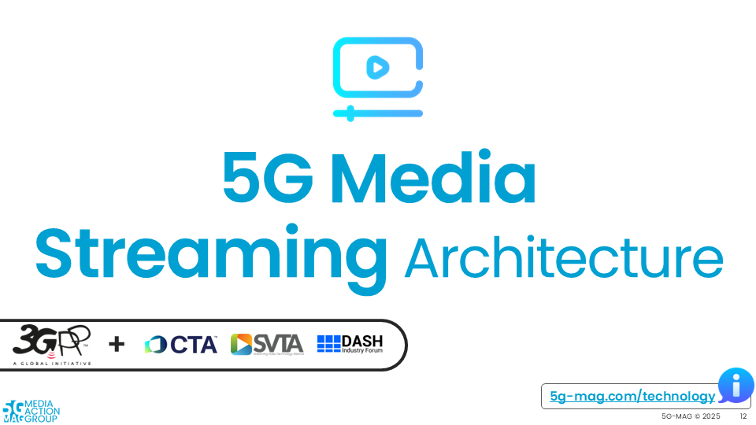<a/></td>
    <td markdown="span" align="center"><a href="./pages/data-collection-event-exposure.html"><a/></td>
  </tr>
  <tr>
    <td markdown="span" align="center">[Technical Resources](./pages/5g-media-streaming.html){: .btn .btn-blue } [Execution Plan](https://github.com/orgs/5G-MAG/projects/44/views/9){: .btn .btn-blue } </td>
    <td markdown="span" align="center">[Technical Resources](./pages/data-collection-event-exposure.html){: .btn .btn-blue } [Execution Plan](https://github.com/orgs/5G-MAG/projects/44/views/21){: .btn .btn-blue } </td>
  </tr>
    <td> </td>
  <tr>
    <td markdown="span" align="center"><a href="./pages/lte-based-5g-broadcast/">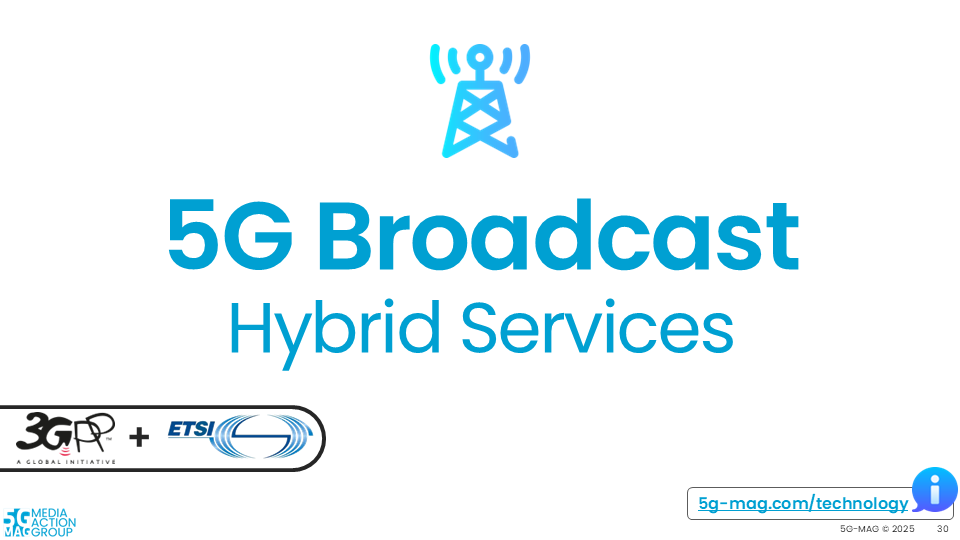<a/></td>
    <td markdown="span" align="center"><a href="./pages/5g-multicast-broadcast-services/">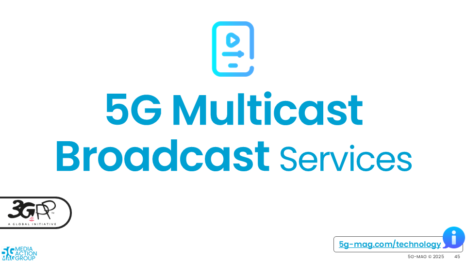<a/></td>
  </tr>
  <tr>
    <td markdown="span" align="center">[Technical Resources](./pages/lte-based-5g-broadcast.html){: .btn .btn-blue } [Execution Plan](https://github.com/orgs/5G-MAG/projects/44/views/10){: .btn .btn-blue } </td>
    <td markdown="span" align="center">[Technical Resources](./pages/5g-multicast-broadcast-services.html){: .btn .btn-blue } [Execution Plan](https://github.com/orgs/5G-MAG/projects/44/views/7){: .btn .btn-blue } </td>
  </tr>
    <td> </td>
  <tr>
    <td markdown="span" align="center"><a href="./pages/rtc.html">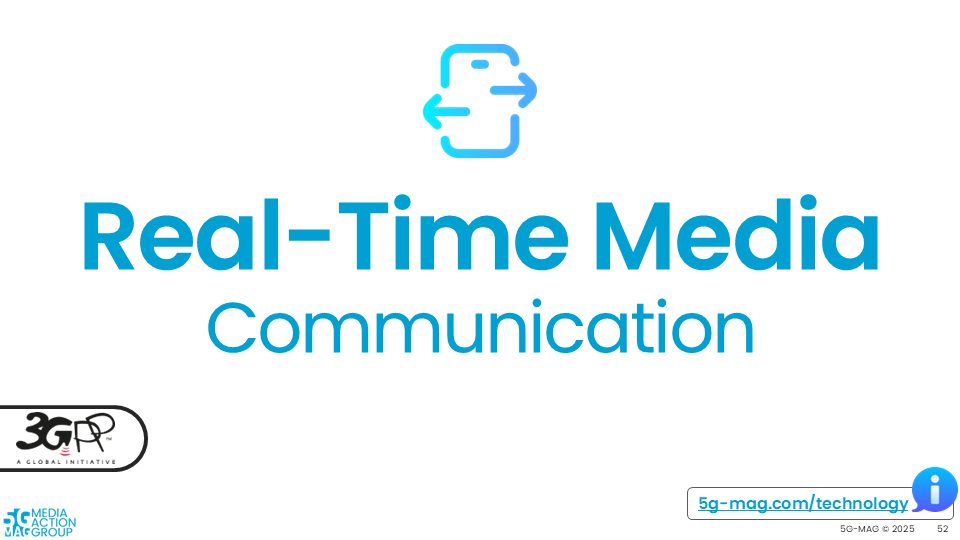<a/></td>
    <td markdown="span" align="center"><a href="./pages/network_apis.html">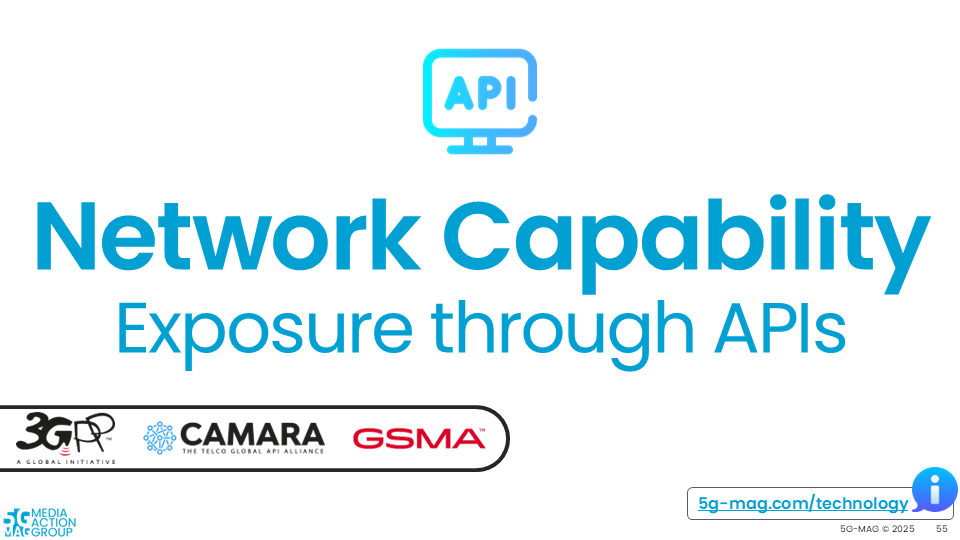<a/></td>
  </tr>
  <tr>
    <td markdown="span" align="center">[Technical Resources](./pages/rtc.html){: .btn .btn-blue } [Execution Plan](https://github.com/orgs/5G-MAG/projects/44/views/19){: .btn .btn-blue } </td>
    <td markdown="span" align="center">[Technical Resources](./pages/network_apis.html){: .btn .btn-blue } [Execution Plan](https://github.com/orgs/5G-MAG/projects/44/views/8){: .btn .btn-blue } </td>
  </tr>
    <td> </td>
  <tr>
    <td markdown="span" align="center"><a href="./pages/ntn.html">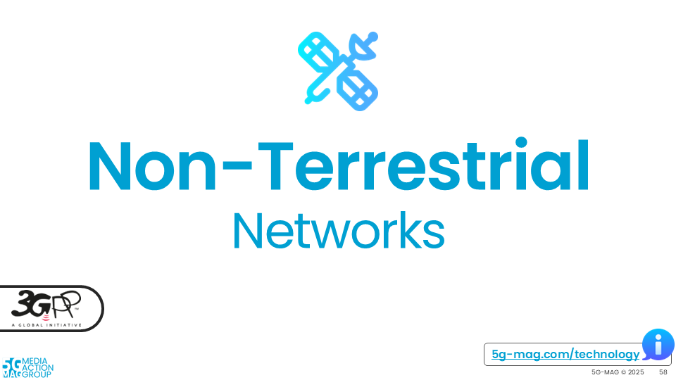<a/></td>
    <td markdown="span" align="center"><a href="./pages/npn.html">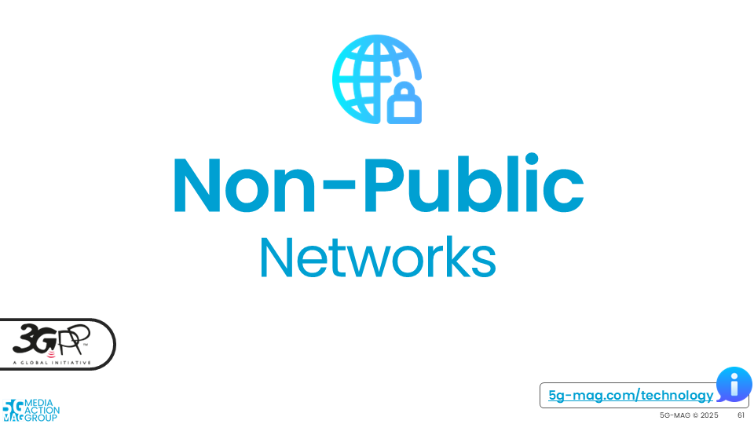<a/></td>
  </tr>
  <tr>
    <td markdown="span" align="center">[Technical Resources](./pages/ntn.html){: .btn .btn-blue } [Execution Plan](https://github.com/orgs/5G-MAG/projects/44/views/6){: .btn .btn-blue } </td>
    <td markdown="span" align="center">[Technical Resources](./pages/npn.html){: .btn .btn-blue } [Execution Plan](https://github.com/orgs/5G-MAG/projects/44/views/11){: .btn .btn-blue } </td>
  </tr>
    <td> </td>
  <tr>
    <td markdown="span" align="center"><a href="./pages/tsc.html">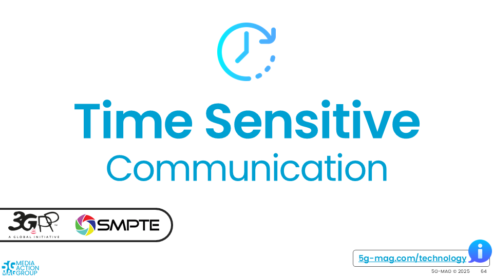<a/></td>
    <td markdown="span" align="center"><a href="./pages/xr.html">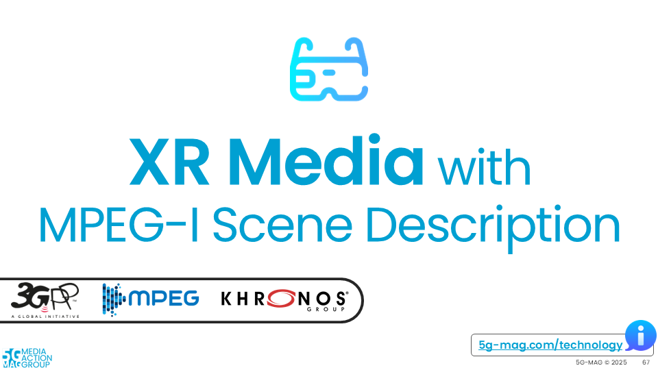<a/></td>
  </tr>
  <tr>
    <td markdown="span" align="center">[Technical Resources](./pages/tsc.html){: .btn .btn-blue } [Execution Plan](https://github.com/orgs/5G-MAG/projects/44/views/12){: .btn .btn-blue } </td>
    <td markdown="span" align="center">[Technical Resources](./pages/xr.html){: .btn .btn-blue } [Execution Plan](https://github.com/orgs/5G-MAG/projects/44/views/13){: .btn .btn-blue } </td>
  </tr>
    <td> </td>
  <tr>
    <td markdown="span" align="center"><a href="./pages/volumetric-video.html">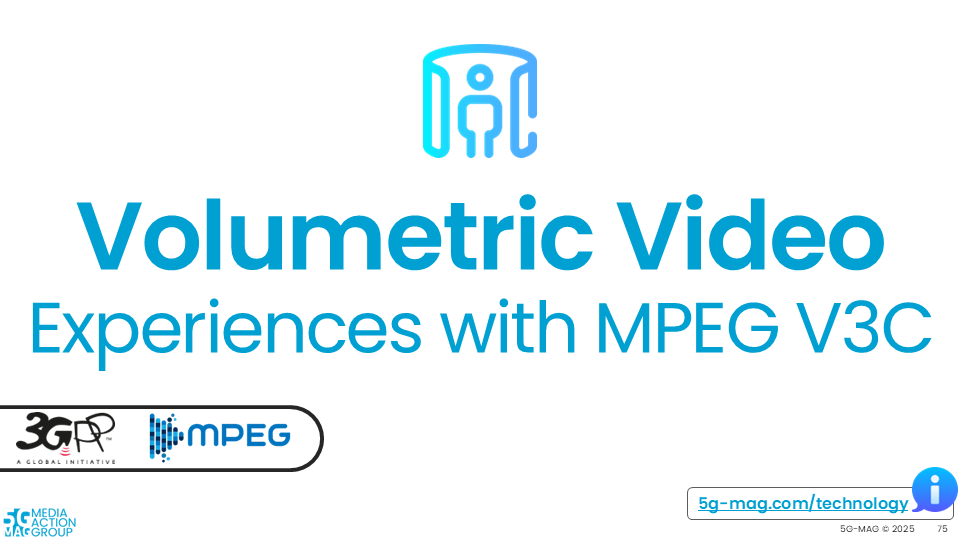<a/></td>
    <td markdown="span" align="center"><a href="./pages/beyond2d.html">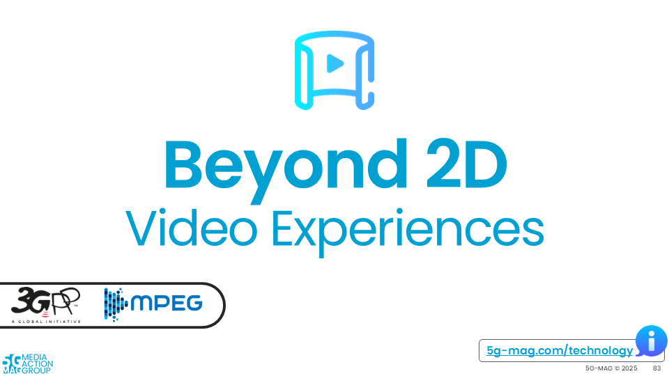<a/></td>
  </tr>
  <tr>
    <td markdown="span" align="center">[Technical Resources](./pages/volumetric-video.html){: .btn .btn-blue } [Execution Plan](https://github.com/orgs/5G-MAG/projects/44/views/18){: .btn .btn-blue } </td>
    <td markdown="span" align="center">[Technical Resources](./pages/beyond2d.html){: .btn .btn-blue } [Execution Plan](https://github.com/orgs/5G-MAG/projects/44/views/15){: .btn .btn-blue } </td>
  </tr>
    <td> </td>
  <tr>
    <td markdown="span" align="center"><a href="./pages/ai-ml-evaluation-framework/"><a/></td>
    <td markdown="span" align="center"><a href="./pages/multimedia-content-delivery/">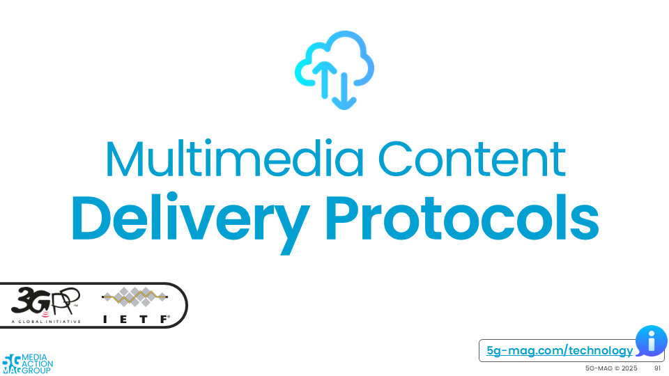<a/></td>
  </tr>
  <tr>
    <td markdown="span" align="center">[Technical Resources](./pages/ai-ml-evaluation-framework/){: .btn .btn-blue } [Execution Plan](https://github.com/orgs/5G-MAG/projects/44/views/16){: .btn .btn-blue } </td>
    <td markdown="span" align="center">[Technical Resources](./pages/multimedia-content-delivery/){: .btn .btn-blue } [Execution Plan](https://github.com/orgs/5G-MAG/projects/44/views/22){: .btn .btn-blue } </td>
  </tr>
    <td> </td>
  <tr>
    <td markdown="span" align="center"><a href="./pages/dvb-i-5g.html">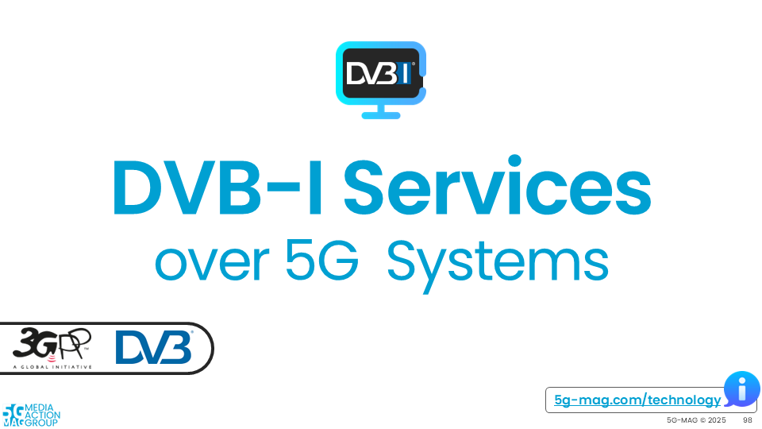<a/></td>
    <td markdown="span" align="center"><a href="./pages/6g.html">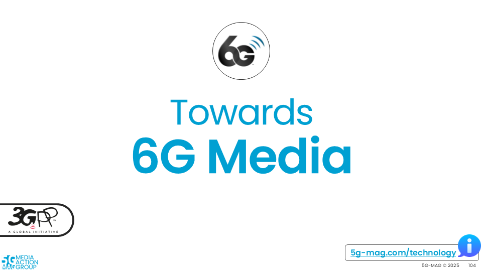<a/></td>
  </tr>
  <tr>
    <td markdown="span" align="center">[Technical Resources](./pages/dvb-i-5g.html){: .btn .btn-blue } [Execution Plan](https://github.com/orgs/5G-MAG/projects/44/views/17){: .btn .btn-blue } </td>
    <td markdown="span" align="center">[Technical Resources](./pages/6g.html){: .btn .btn-blue } [Execution Plan](https://github.com/orgs/5G-MAG/projects/44/views/20){: .btn .btn-blue } </td>
  </tr>
</table>

{: .note }
Please refer to the [Tech](https://github.com/5G-MAG/Tech/) repository to provide updates to this documentation.
