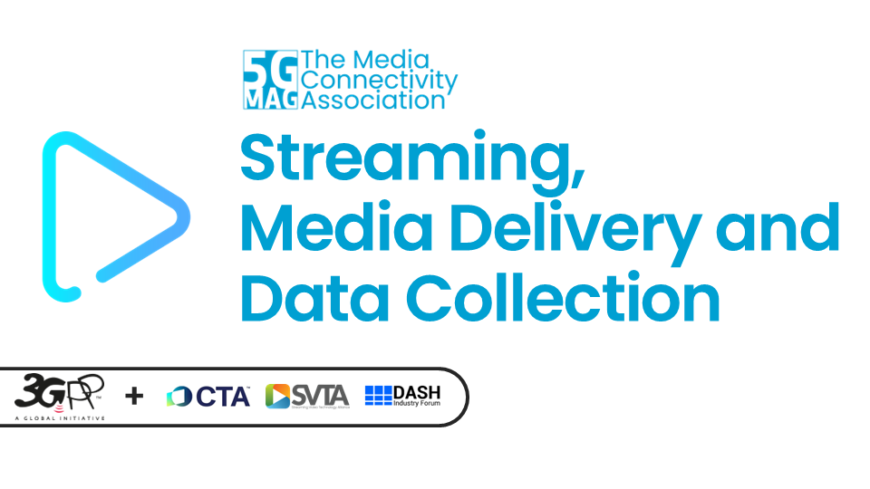
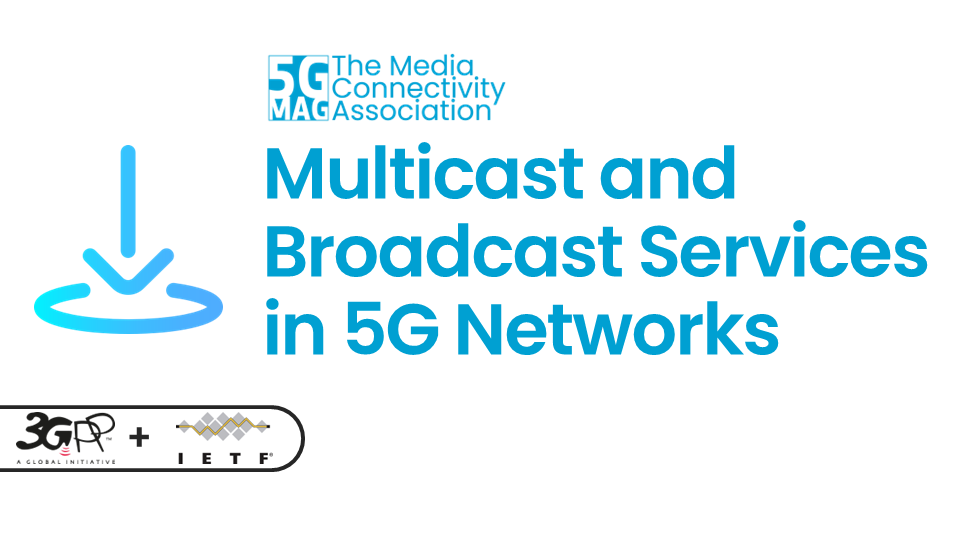
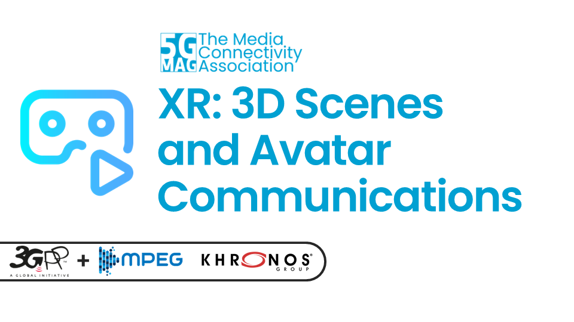
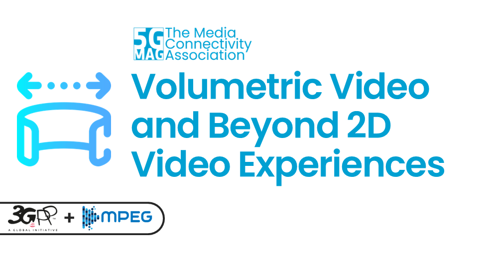
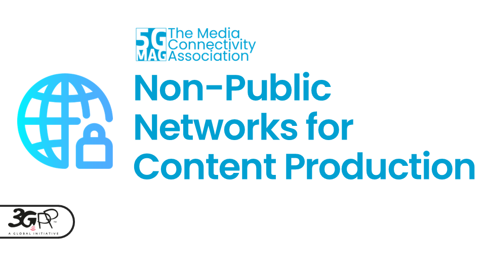
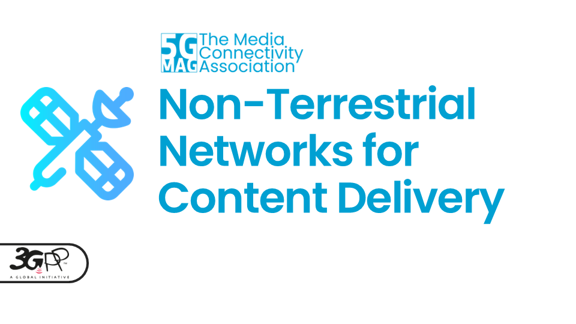
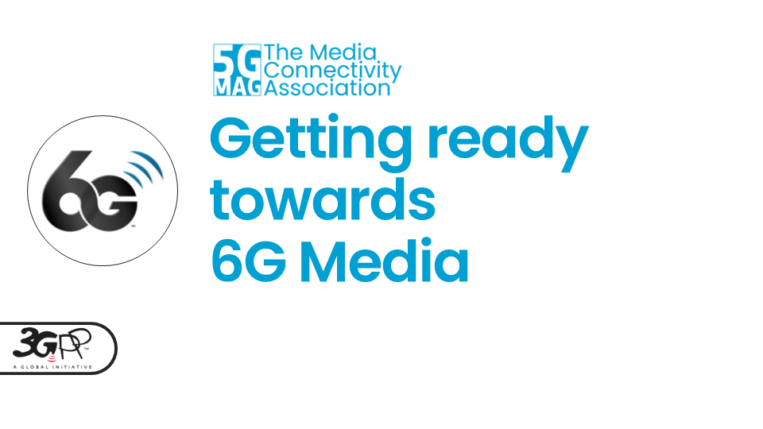

 

[Go to Reference Tools](https://developer.5g-mag.com){: .btn .btn-blue } [Go to Standards](https://standards.5g-mag.com){: .btn .btn-blue } [Video Library](./pages/videos.html){: .btn .btn-video }

This is the entry point to **5G-MAG's Technical Documentation**. It includes resources related to specification analysis and implementation, explainers and reports, videos,...

[Download an overview about 5G-MAG](./docs/5G_MAG_Overview.pdf){: .btn .btn-blue }

---

# What is 5G-MAG currently working on?

<table>
  <tr>
    <td markdown="span" align="center" width="33%"><a href="./pages/streaming.html"><a/></td>
    <td markdown="span" align="center" width="33%"><a href="./pages/5gbroadcast.html"><a/></td>
    <td markdown="span" align="center" width="33%"><a href="./pages/multicastbroadcast.html"><a/></td>
  </tr>
  <tr>
    <td markdown="span" align="center" width="33%">[Technical Documentation](./pages/streaming.html){: .btn .btn-blue } [Execution Plan](https://github.com/orgs/5G-MAG/projects/44/views/6){: .btn .btn-blue }</td>
    <td markdown="span" align="center" width="33%">[Technical Documentation](./pages/5gbroadcast.html){: .btn .btn-blue } [Execution Plan](https://github.com/orgs/5G-MAG/projects/44/views/7){: .btn .btn-blue }</td>
    <td markdown="span" align="center" width="33%">[Technical Documentation](./pages/multicastbroadcast.html){: .btn .btn-blue } [Execution Plan](https://github.com/orgs/5G-MAG/projects/44/views/8){: .btn .btn-blue }</td>
  </tr>
    <td> </td><td> </td><td> </td>
  <tr>
    <td markdown="span" align="center" width="33%"><a href="./pages/xr.html"><a/></td>
    <td markdown="span" align="center" width="33%"><a href="./pages/volumetric.html"><a/></td>
    <td markdown="span" align="center" width="33%"><a href="./pages/npn.html"><a/></td>
  </tr>
  <tr>
    <td markdown="span" align="center" width="33%">[Technical Documentation](./pages/xr.html){: .btn .btn-blue } [Execution Plan](https://github.com/orgs/5G-MAG/projects/44/views/9){: .btn .btn-blue }</td>
    <td markdown="span" align="center" width="33%">[Technical Documentation](./pages/volumetric.html){: .btn .btn-blue } [Execution Plan](https://github.com/orgs/5G-MAG/projects/44/views/10){: .btn .btn-blue }</td>
    <td markdown="span" align="center" width="33%">[Technical Documentation](./pages/npn.html){: .btn .btn-blue } [Execution Plan](https://github.com/orgs/5G-MAG/projects/44/views/11){: .btn .btn-blue }</td>
  </tr>
    <td> </td><td> </td><td> </td>
  <tr>
    <td markdown="span" align="center" width="33%"><a href="./pages/network_apis.html"><a/></td>
    <td markdown="span" align="center" width="33%"><a href="./pages/ntn.html"><a/></td>
    <td markdown="span" align="center" width="33%"><a href="./pages/6g.html"><a/></td>
  </tr>
  <tr>
    <td markdown="span" align="center" width="33%">[Technical Documentation](./pages/network_apis.html){: .btn .btn-blue } [Execution Plan](https://github.com/orgs/5G-MAG/projects/44/views/12){: .btn .btn-blue }</td>
    <td markdown="span" align="center">[Technical Documentation](./pages/ntn.html){: .btn .btn-blue } [Execution Plan](https://github.com/orgs/5G-MAG/projects/44/views/13){: .btn .btn-blue }</td>
    <td markdown="span" align="center" width="33%">[Technical Documentation](./pages/6g.html){: .btn .btn-blue } [Execution Plan](https://github.com/orgs/5G-MAG/projects/44/views/15){: .btn .btn-blue }</td>
  </tr>
</table>

{: .note }
Please refer to the [Tech](https://github.com/5G-MAG/Tech/) repository to provide updates to this documentation.
