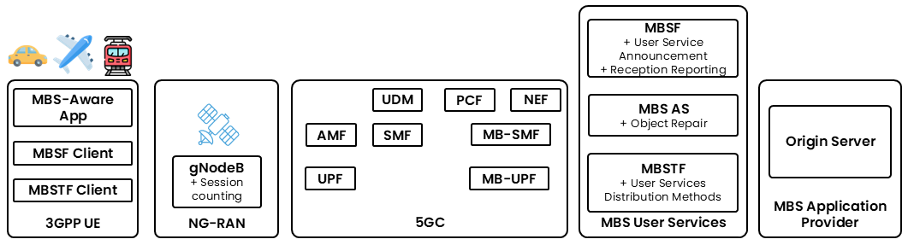

{: .warning }
This documentation is currently **under development and subject to change**. It reflects outcomes elaborated by 5G-MAG members as part of **WI: Content Delivery over NTNs** and **WI: Multicast Broadcast Services**
We welcome and encourage contributions from the broader community. If you are interested in becoming a member of the 5G-MAG and actively participating in shaping this work, please contact the [Project Office](https://www.5g-mag.com/contact)

# Analysis - MBS Delivery Mode 1 (Multicast) over NTN

## Requirements and Overview for the delivery of multicast content with autonomous RAN switching between point-to-point and point-to-multipoint

### Application Service Provider
* An Application Service Provider makes available over the Internet services (e.g. TV, radio, any linear/live streaming service) which users can access through an application installed on their devices (e.g. a smartphone, a smart TV, tablet, etc.).
*	The Application Service Provider additionally provisions these as multicast services in the 5G Core of the NTN.

{: .warning }
To be checked: Provision of MBS Multicast services over the 5G Network with traffic originally coming from a streaming service available over the internet and to client applications already deployed in user equipment.
Note that this is an aspect related to MBS and it is captured here: [MBS Service Layer Aspects](../5g-multicast-broadcast-services/mbs-service-layer.html)

### Network and access to services
*	The gNodeB of the NTN (“Donor gNodeB”) is deployed either at the ground station (Transparent Payload architecture) or on board the spacecraft (Regenerative Payload, not illustrated).
*	The NTN operator offers mobile broadband access to their subscribed users.
*	The NTN supports multicast user services.
*	A set of multicast services is provisioned in the NTN that deliver content to UEs using either point-to-point or point-to-multipoint multicast communication, at the discretion of the Donor gNodeB.
*	Optionally, the NTN operator may collaborate with the Application Service Provider to ensure the delivery of content with a desired Quality of Service, including the provision of network assistance and/or UE data collection and reporting, among other functionalities.
*	The NTN has the ability to detect concurrent consumption of services by multiple users and may use parameters such as session counting to trigger unicast-to-multicast switching at upper layers.
*	The Donor gNodeB is able to autonomously switch the delivery mode of multicast packets between point-to-point to point-to-multipoint according to the number of UEs attempting to receive multicast user services concurrently.

{: .warning }
To be checked: Provision of MBS Multicast services which can be delivered either by means of point-to-point of point-to-multipoint and the mechanism by which concurrent consumption of a service by multiple users and session counting is performed.
Note that this is an aspect related to MBS and it is captured here: [MBS Service and System Aspects](../5g-multicast-broadcast-services/mbs-service-system-aspects.html)

### Device considerations
*	User Equipment directly connected to the NTN (including UEs or a Mobile Relay Node in a moving platform) requires subscription and registration with the NTN operator in order to obtain mobile broadband connectivity and access to the desired services.
*	In addition, the NTN operator authorises UEs that are able to consume multicast user services.
*	In order to obtain network connectivity and access to the desired services, User Equipment connected to a Mobile Relay Node within a moving platform requires either subscription and registration with the moving platform network operator (which could be the same as or different from the NPN) or directly with the NTN operator.

### Mobility, handover, service interruption and reliability requirements
*	The delivery of multicast data packets using point-to-point or point-to-multipoint transmission should rely on mechanisms that ensure reliability and in-sequence delivery. User Equipment should be able to request repair of faulty or lost multicast data packets to increase delivery reliability.
*	For critical applications, lossless mobility without interruption should be guaranteed when UEs transit across different satellite coverage areas, even when those different coverage areas are served by different NTNs operated by the same NTN operator (e.g. from LEO to GEO with a common 5G Core). Interruption-free multicast user service should be guaranteed when a UE is served from a gNodeB which switches multicast packet delivery from point-to-multipoint to point-to-point communication and vice versa.
*	For services with less stringent requirements, some level of multicast user service interruption may be tolerable when a UE transits across different coverage areas, including when those different coverage areas are served by different NTNs. Some level of interruption may be tolerable when a UE is served from a gNodeB which switches multicast packet delivery from point-to-multipoint to point-to-point communication and vice versa.

{: .warning }
To be checked: Mobility aspects in relation to NTN are captured here: [Aspects on Mobility for NTN](../NTN/Mobility_NTN.html). Mobility aspects in relation to MBS are captured here: [Aspects on Mobility for MBS Multicast Services](../5g-multicast-broadcast-services/Mobility_MBS_Multicast.html). Mobility aspects in relation to MBS and NTN are captured here: [Aspects on Mobility for MBS Multicast over NTN](../NTN/Mobility_NTN_MBS_Multicast.html)
