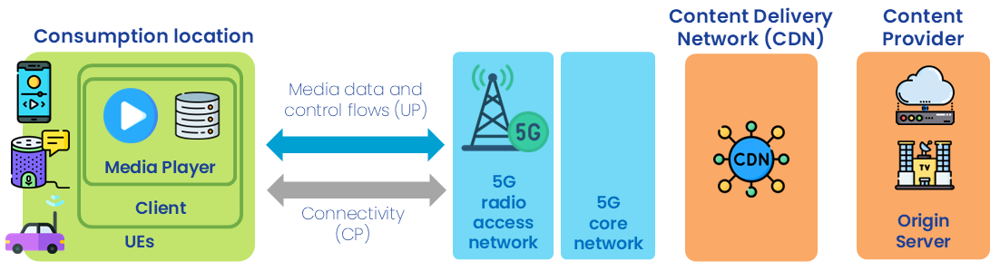

{: .warning }
This documentation is currently **under development and subject to change**. It reflects outcomes elaborated by 5G-MAG members as part of **WI: Network Exposure and APIs Supporting Media Services and Applications**
We welcome and encourage contributions from the broader community. If you are interested in becoming a member of the 5G-MAG and actively participating in shaping this work, please contact the [Project Office](https://www.5g-mag.com/contact)

# Network Capability Exposure and APIs for Audio Streaming Services

## Scenario description and actors involved

The actors involved are:

