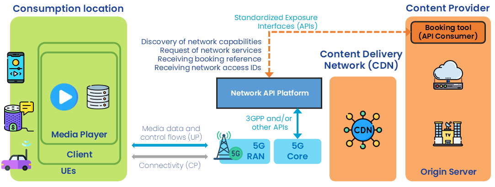
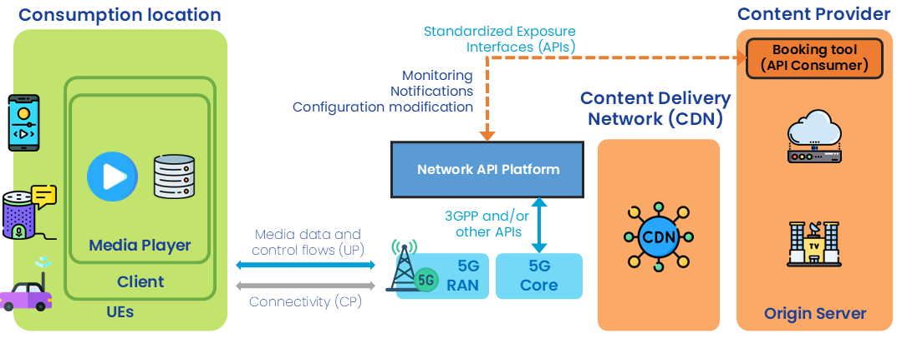

{: .warning }
This documentation is currently **under development and subject to change**. It reflects outcomes elaborated by 5G-MAG members as part of **WI: Network Exposure and APIs Supporting Media Services and Applications**
We welcome and encourage contributions from the broader community. If you are interested in becoming a member of the 5G-MAG and actively participating in shaping this work, please contact the [Project Office](https://www.5g-mag.com/contact)

# Required interactions to exploit network capabilities
  
## Pre-conditions

* A content provider wishes to stream live segmented-audio over the internet, including mobile networks, to an application running on standards off-the-shelf 3GPP UEs (e.g. smartphones, connected cars, etc.).
* The content provider has the ability to use certain **network capabilitues** (e.g. selected from an API catalogue) and has received authentication credentials from the newotk operator authorising their use (when available).
* The content provider has access to one or several **Network API Platforms**. These platforms are accessible through any device/connectivity (e.g. Internet-acccessible website portal, command line tools, dedicated application, etc.).
  * Note: For Network API Platform access, the content provider has obtained key access tokens/keys/credentials/payment details in advance.
 
## Before consuming the audio streaming service

### Phase A: Preparing the audio streaming application

* All devices are 3GPP UEs (e.g. smartphones, connected cars, etc.) with a content provider's client application (e.g. radio player app) installed.
 
### Phase B: Network capability pre-booking

1. Through the Network API Platform, the content provider requests network services for the population of client applications in (a) certain area/s. Possible services (network capabilities) are:
   1. *Quality-on-Demand*
      * Provision of realiably low-latency (e.g. latency and interruption-free audio playblack similar to conventional broadcast radio).
      * Ability to set quality on demand requirements for a given location
   2. *Geofencing*
      * To verify and/or retrieve the location of a UE or to receive notifications from UEs entering or leaving certain locations/areas (e.g. for determining the content appropriate for the current editorial region).
        
Note: Booking is done based on:
 * Geographical location
 * Schedule

2. Through the Network API Platform the content provider receives a booking reference responding to the service request.
3. Through the Network API Platform the content provider accepts the service booking offer.
4. Through the Network API Platform the content provider receives **network access IDs** to be used by the UEs to access the network capabilities on the expected location.
  * **Is this the way to identify clients/applications?**
 
## While consuming the audio streaming service

### Phase C: Setuop and configuration
* The content provider configures the content provider's client application with the network access IDs delivered in step B.4.

### Independent steps that can be triggered by the content provider
* The content provider can use the Network API Platform to monitor that the client applications are properly using the requested network capabilities.
* The content provider receives notification through the Network API Platform indicating potential issues (throughput, delay, etc.).
* The content provider through the Network API Platform can request a change of the current configuration.

Note: Network access IDs are not expected to change when a reconfiguration occurs.
 
## After having consumed the audio streaming service
### Phase D: Teardown
1. Through the Network API Platform, the content provider releases the booked network capabilities.
