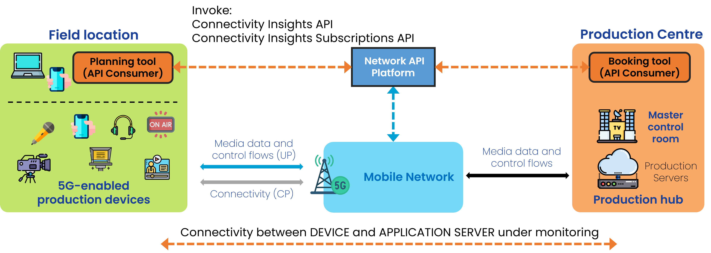

{: .warning }
This documentation is currently **under development and subject to change**. It reflects outcomes elaborated by 5G-MAG members. If you are interested in becoming a member of the 5G-MAG and actively participating in shaping this work, please contact the [Project Office](https://www.5g-mag.com/contact)

# CAMARA: Connectivity Insights API Family

## Description

Visibility into network quality, check if application’s network requirements can be met for a given user session. Based on the API’s response, informed decisions can be taken.

## Relation of APIs
### Connectivity Insights API
  * **POST /check-network-quality** with the request body containing an `applicationProfileId`, `device`, `applicationServer (IP:port)` - Check the network quality. Response shows the network's current level of confidence (qualitative) that it can meet an application profile's quality thresholds (according to those defined in the `applicationProfileId`for a given end user device.

{: .note }
Requires `applicationProfileId` from a previous call to the [**Application Profiles API**](./CAMARA_ApplicationProfiles.html).

### Connectivity Insights Subscriptions API
  * **POST /subscriptions** with the request body containing a `device`, `applicationServer (IP:port)`, `applicationProfileId` and an indication of expiration time and maximun number of events. Response contains a `subscriptionId`.
  * **GET /subscriptions** - Operation to list subscriptions authorized to be retrieved by the provided access token.
  * **GET /subscriptions/{subscriptionId}** - Retrieve a given subscription by ID.
  * **DELETE /subscriptions/{subscriptionId}** - Delete a given subscription by ID

Information: [https://github.com/camaraproject/ConnectivityInsights](https://github.com/camaraproject/ConnectivityInsights)

The API definitions can be obtained here: [https://github.com/camaraproject/ConnectivityInsights/tree/main/code/API_definitions](https://github.com/camaraproject/ConnectivityInsights/tree/main/code/API_definitions)

## Workflow: Media application requesting Connectivity Insights

A user of a media application would like to obtain Connectivity Insights about the ability of the network to meet the requirements. The following steps are executed:

<figure>
  
</figure>

### Step 0: Pre-conditions
* Create an application profile using the **Application Profiles API** (with the relevant application requirements).
* Create a device object for the device which media flow is to be monitored.
* Obtain IP address and port of the application server (Production Server).

### Step 1a: One-shot information on network quality
* **POST /check-network-quality**, passing the **applicationProfileId** obtained in step 0, the address/port of an application server, and a device object.

### Step 1b: Recurrent events/notifications on network quality
* **POST /subscriptions**, passing the **applicationProfileId** obtained in step 0, the address/port of an application server, and a device object. Indicate expiration time and maximum number of events.

## 5G-MAG's Self-Assessment

The APIs are likely to be invoked to obtain information about the ability of the network to meet the requirements either before or during operation. However:
- The information received is instantaneous. There is no guarantee that the network can meet the requirements at any other time.
- The information received is qualitative (e.g. `"targetMinDownstreamRate": "meets the application requirements"`). An application would be unable to understand which parameters to be adapted in order to revert a situation in which requirements cannot be met.

Potential improvements:
- the ability to request guaranteed performance during actual operation time is a pre-condition as just receiving notifications in a qualitative manner may not bring enough information.
- an indication of the actual performance parameters (quantitative) for those defined in the Application Profile may provide better insight for potential remedies.

---

## Application Profiles API Usage
Check: [**Application Profiles API**](./CAMARA_ApplicationProfiles.html). The type of parameters that an `applicationProfile` defines includes:

```
{
  "networkQualityThresholds": {
    "packetDelayBudget": {
      "value": 12,
      "unit": "Minutes"
    },
    "targetMinDownstreamRate": {
      "value": 10,
      "unit": "Bps"
    },
    "targetMinUpstreamRate": {
      "value": 10,
      "unit": "Bps"
    },
    "packetLossErrorRate": 3,
    "jitter": {
      "value": 12,
      "unit": "Minutes"
    }
  },
  "computeResources": {
    "targetMinCPU": 0.5,
    "targetMinMemory": {
      "value": 10,
      "unit": "Kb"
    },
    "gpuVendorType": "Nvidia",
    "gpuModelName": "string",
    "targetMinGPU": 1,
    "targetMinGPUMemory": {
      "value": 10,
      "unit": "Kb"
    },
    "targetMinEphemeralStorage": {
      "value": 10,
      "unit": "Kb"
    },
    "targetMinPersistentStorage": {
      "value": 10,
      "unit": "Kb"
    }
  }
}
```

## Device object

This is how a device is defined:

```
  "device": {
    "phoneNumber": "123456789",
    "networkAccessIdentifier": "123456789@domain.com",
    "ipv4Address": {
      "publicAddress": "84.125.93.10",
      "publicPort": 59765
    },
```
## Connectivity Insights API Usage

### Obtain information about network quality
With **POST /check-network-quality** passing:
  - the **ApplicationProfileId**,
  - the device object
  - identifier for the application server (IPv4 and/or IPv6 address and ports)

```
{
  "applicationProfileId": "3fa85f64-5717-4562-b3fc-2c963f66afa6",
  "device": {
    "phoneNumber": "123456789",
    "networkAccessIdentifier": "123456789@domain.com",
    "ipv4Address": {
      "publicAddress": "84.125.93.10",
      "publicPort": 59765
    },
    "ipv6Address": "2001:db8:85a3:8d3:1319:8a2e:370:7344"
  },
  "applicationServer": {
    "ipv4Address": "192.168.0.1/24",
    "ipv6Address": "2001:db8:85a3:8d3:1319:8a2e:370:7344"
  },
  "applicationServerPorts": {
    "ranges": [
      {
        "from": 5010,
        "to": 5020
      }
    ],
    "ports": [
      5060,
      5070
    ]
  },
  "monitoringTimeStamp": "2023-07-03T12:27:08.312Z"
}
```

Type of response: The network's current level of confidence that it can meet an application profile's quality thresholds for a given end user device.

```
{
  "packetDelayBudget": "meets the application requirements",
  "targetMinDownstreamRate": "meets the application requirements",
  "targetMinUpstreamRate": "meets the application requirements",
  "packetlossErrorRate": "meets the application requirements",
  "jitter": "meets the application requirements",
  "additionalKPIs": {
    "signalStrength": "excellent",
    "connectivityType": "5G-SA"
  }
}
```

## Connectivity Insights Subscriptions API Usage

### Create a subcription for a device
With **POST /subscriptions**

```
{
  "protocol": "HTTP",
  "sink": "https://endpoint.example.com/sink",
  "sinkCredential": {},
  "types": [
    "org.camaraproject.connectivity-insights-subscriptions.v0.network-quality"
  ],
  "config": {
    "subscriptionDetail": {
      "device": {
        "phoneNumber": "123456789",
        "networkAccessIdentifier": "123456789@domain.com",
        "ipv4Address": {
          "publicAddress": "84.125.93.10",
          "publicPort": 59765
        },
        "ipv6Address": "2001:db8:85a3:8d3:1319:8a2e:370:7344"
      },
      "applicationServer": {
        "ipv4Address": "192.168.0.1/24",
        "ipv6Address": "2001:db8:85a3:8d3:1319:8a2e:370:7344"
      },
      "applicationServerPorts": {
        "ranges": [
          {
            "from": 5010,
            "to": 5020
          }
        ],
        "ports": [
          5060,
          5070
        ]
      },
      "applicationProfileId": "3fa85f64-5717-4562-b3fc-2c963f66afa6"
    },
    "subscriptionExpireTime": "2023-07-03T12:27:08.312Z",
    "subscriptionMaxEvents": 5,
    "initialEvent": true
  }
}
```

Type of response: A **subcriptionId**

```
{
  "sink": "https://endpoint.example.com/sink",
  "types": [
    "string"
  ],
  "config": {
    "subscriptionDetail": {
      "device": {
        "phoneNumber": "123456789",
        "networkAccessIdentifier": "123456789@domain.com",
        "ipv4Address": {
          "publicAddress": "84.125.93.10",
          "publicPort": 59765
        },
        "ipv6Address": "2001:db8:85a3:8d3:1319:8a2e:370:7344"
      },
      "applicationServer": {
        "ipv4Address": "192.168.0.1/24",
        "ipv6Address": "2001:db8:85a3:8d3:1319:8a2e:370:7344"
      },
      "applicationServerPorts": {
        "ranges": [
          {
            "from": 5010,
            "to": 5020
          }
        ],
        "ports": [
          5060,
          5070
        ]
      },
      "applicationProfileId": "3fa85f64-5717-4562-b3fc-2c963f66afa6"
    },
    "subscriptionExpireTime": "2023-07-03T12:27:08.312Z",
    "subscriptionMaxEvents": 5,
    "initialEvent": true
  },
  "subscriptionId": "1119920371",
  "startsAt": "2023-07-03T12:27:08.312Z",
  "expiresAt": "2023-07-03T12:27:08.312Z",
  "status": "ACTIVATION_REQUESTED"
}
```
