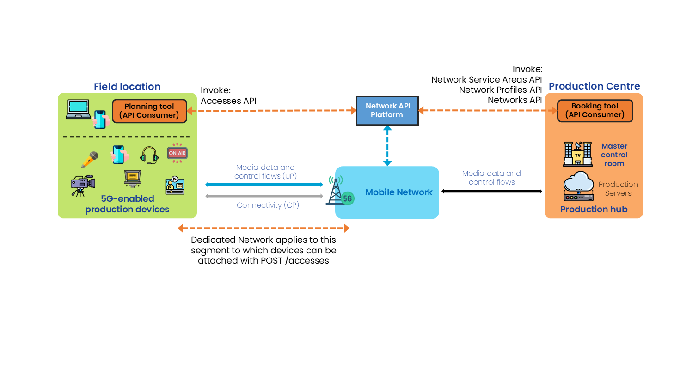

{: .warning }
This documentation is currently **under development and subject to change**. It reflects outcomes elaborated by 5G-MAG members. If you are interested in becoming a member of the 5G-MAG and actively participating in shaping this work, please contact the [Project Office](https://www.5g-mag.com/contact)

# CAMARA: Dedicated Networks

## Description

The “Dedicated Networks” APIs provide functionalities for reserving network connectivity resources, selecting network capabilities, and controlling access for devices.

## Relation of APIs
### Dedicated Network - Network Profiles API
  * **GET /profiles** - List of available network profiles. The response includes an `id`, alongside the `maxNumberOfDevices`, `aggregatedUlThroughput`, `aggregatedDlThroughput`, `qosProfiles`,...
  * **GET /profiles/{profileId}** - Read a dedicated network profile

### Dedicated Network - Networks API
  * **GET /networks** - List of dedicated networks (the list can be empty)
  * **POST /networks** with the request body including the chose Network Profile `profileId`, `serviceTime` start and end, `serviceArea` is used to request the creation of a dedicated network. The response includes an `id` and the `status`of the request. A `sink` for notifications can be optionally indicated.
  * **GET /networks/{networkId}** - get the current information about a dedicated network
  * **DELETE /networks/{networkId}** - delete a dedicated network

### Dedicated Network - Accesses API
  * **GET /accesses** - List of existing device accesses to dedicated networks, optionally filtered for a given device and/or for a dedicated network (the list can be empty)
  * **POST /accesses** with the request body including the `networkId` received after invoking the Dedicated Network API (`id`), a `device` object, `qosProfiles`, this request will crate a device access to a dedicated network with a fiven configutation. The response includes an `id`.
  * **GET /accesses/{accessId}** - get a device access to the dedicated network and its configuration
  * **DELETE /accesses/{accessId}** - delete a device access to the dedicated network

Information: [https://github.com/camaraproject/DedicatedNetworks](https://github.com/camaraproject/DedicatedNetworks)

The API definitions can be obtained here: [https://github.com/camaraproject/DedicatedNetworks/tree/main/code/API_definitions](https://github.com/camaraproject/DedicatedNetworks/tree/main/code/API_definitions)

## Workflow: Media application requesting Dedicated Network

A user of a media application would like to request a Dedicated Network, with a set of capabilities and connectivity performance targets. The resut is for a particular geographical location and at a particular time window. The following steps are executed:

<figure>
  
</figure>

### Step 0: Pre-conditions
* qosProfiles have already been defined and made available by the network operator. This is related to the [**Quality on Demand API**](./CAMARA_QualityonDemand.html).
* Network Profiles with the allowed number of devices which can be server concurrently together with the aggregated UL and DL thoughput have been defined and made available by the network operator

### Step 1: Discover Network Profiles available
* **GET /networks** to obtain a list of dedicated networks with the corresponding `id`.

### Step 2: Create a Dedicated Network
* **POST /networks** passing the Network Profile `profileId` from Step 1, `serviceTime` start and end and `serviceArea`.

### Step 3: Attach a Device to a Dedicated Network
* **POST /accesses** passing the Network Profile `networkId` from Step 2, a `device` object, and `qosProfile`.

### Step 4: During operation, delete a device access and attach a new device to a dedicated network or the same device to a different dedicated network
**DELETE /accesses/{accessId}** and **POST /accesses** should be used to detach or attach devices to a different dedicated network

## 5G-MAG's Self-Assessment

The Profiles and Networks APIs are to be invoked before the actual usage of the network to ensure that the requested capabilities are "reserved" for the specific area and time window.
During the event devices will have access to the Dedicated Network and should be allocated or de-allocated depending on the actual requirements.

Potential improvements:
- there is a dependency with qosProfiles and Network Profiles, which need to be present before being able to invoke Dedicated Networks. This is not an issue related to this API but worth considering as it would be useful if such profiles could be created/requested by the user and accepted by the network operator, rather than requiring another process.
- a media production event may involve several devices eventually making use of a Dedicated Network, but not simultaneously. It should be clarified if the maximum number of devices means the devices concurrently using the resources allocated to the Dedicated Network or any device suitable to make use of the Dedicated Network. In practice, I may want to bring 10 devices suitable to access a Dedicated Network at some point but only have 2 of them making use of the Dedicated Network simultaneously.

---

## Dedicated Network - Network Profiles API Usage

This API allows for discovering available network profiles, which are offered by the network provider to be used in conjunction of the Dedicated Network API. Network profiles describe the capabilities and performance targets of a dedicated network.

With **GET /profiles** a list of available network profiles can be retrieved

```
[
  {
    "id": "string",
    "maxNumberOfDevices": 0,
    "aggregatedUlThroughput": {
      "value": 10,
      "unit": "bps"
    },
    "aggregatedDlThroughput": {
      "value": 10,
      "unit": "bps"
    },
    "qosProfiles": [
      "QCI_1_voice"
    ],
    "defaultQosProfile": "QCI_1_voice"
  }
]
```

## Dedicated Network - Networks API Usage

This API allows for requesting a Dedicated Network, which provides a set of capabilities and connectivity performance targets. The Dedicated Network may be requested for a particular geographical location and at a particular time window. Depending on the requested start time for the dedicated network, the network may first enter a reserved state.

### Request the creation of a dedicated network
With **POST /networks**, passing a **profileId**, **serviceTime**, **serviceArea**, among others.

```
{
  "profileId": "string",
  "serviceTime": {
    "start": "2025-11-05T14:14:35.390Z",
    "end": "2025-11-05T14:14:35.390Z"
  },
  "serviceArea": {},
  "sink": "https://1IG+u7oa.fNS?9-`Zg`Fi*'k",
  "sinkCredential": {}
}
```

Type of response: Information about the **status** of the request.

```
{
  "profileId": "string",
  "serviceTime": {
    "start": "2025-11-05T14:14:35.392Z",
    "end": "2025-11-05T14:14:35.392Z"
  },
  "serviceArea": {},
  "sink": "https://E@g-!#-fZu+}jH*Z~!HO1,!UmF'CA<19OpZ0Z))",
  "sinkCredential": {},
  "id": "3fa85f64-5717-4562-b3fc-2c963f66afa6",
  "status": "REQUESTED"
}
```

## Dedicated Network - Accesses API Usage

This API allows for requesting network access for devices. A device is identified by the CAMARA device object, containing either an MSIDSN or a Network Access Identifier.
A Device Access represents the permission for a specific device to use a Dedicated Network's reserved connectivity resources. Only devices for which a Device Access resource has been created can use the connectivity resources allocated for that network. The usage of resources can be tailored to each device within the constraints of the applicable Network Profile.

With **POST /accesses** a device access can be created

```
{
  "networkId": "3fa85f64-5717-4562-b3fc-2c963f66afa6",
  "device": {
    "phoneNumber": "+123456789",
    "networkAccessIdentifier": "123456789@domain.com",
    "ipv4Address": {
      "publicAddress": "84.125.93.10",
      "publicPort": 59765
    },
    "ipv6Address": "2001:db8:85a3:8d3:1319:8a2e:370:7344"
  },
  "qosProfiles": [
    "string"
  ],
  "defaultQosProfile": "string"
}
```

Type of response: An **id** for the requested device access.

```
{
  "networkId": "3fa85f64-5717-4562-b3fc-2c963f66afa6",
  "device": {
    "phoneNumber": "+123456789",
    "networkAccessIdentifier": "123456789@domain.com",
    "ipv4Address": {
      "publicAddress": "84.125.93.10",
      "publicPort": 59765
    },
    "ipv6Address": "2001:db8:85a3:8d3:1319:8a2e:370:7344"
  },
  "qosProfiles": [
    "string"
  ],
  "defaultQosProfile": "string",
  "id": "3fa85f64-5717-4562-b3fc-2c963f66afa6"
}
```

## Device object

This is how a device is defined:

```
  "device": {
    "phoneNumber": "123456789",
    "networkAccessIdentifier": "123456789@domain.com",
    "ipv4Address": {
      "publicAddress": "84.125.93.10",
      "publicPort": 59765
    },
```
