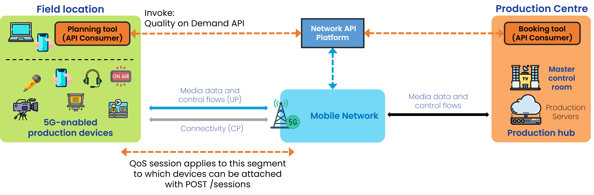

{: .warning }
This documentation is currently **under development and subject to change**. It reflects outcomes elaborated by 5G-MAG members. If you are interested in becoming a member of the 5G-MAG and actively participating in shaping this work, please contact the [Project Office](https://www.5g-mag.com/contact)

# CAMARA: Quality on Demand API

## Description

The “Quality-On-Demand” (QoD) API provides a programmable interface for developers to request stable latency or prioritized throughput managed by networks. This API abstracts the complexity of underlying network technologies — such as mobile, fiber, cable, and other broadband networks — allowing developers to focus on enhancing user experiences for applications that demand high-quality network communication.

Information: [https://camaraproject.org/quality-on-demand/](https://camaraproject.org/quality-on-demand/) and [https://github.com/camaraproject/QualityOnDemand](https://github.com/camaraproject/QualityOnDemand)

The API definitions can be obtained here: [https://github.com/camaraproject/QualityOnDemand/tree/main/code/API_definitions](https://github.com/camaraproject/QualityOnDemand/tree/main/code/API_definitions)

## Relation of APIs

### Quality on Demand API
  * **POST /sessions** with the request body including a `device` object, `applicationServer` IP, `applicationServerPorts`, `devicePorts`, `qosProfile` and `duration`, it is used to create a QoS session to manage latency/throughput priorities. The response includes information about the creation of the session, with a `sessionId`.
    * Dependency: Requires `qosProfiles` which can be retrieved from a previous call to the [**QoS Profiles API**](./CAMARA_QoSProfiles.html).
  * **GET /sessions/{sessionId}** - Get QoS session information
  * **DELETE /sessions/{sessionId}** - Delete a QoS session
  * **POST /sessions/{sessionId}/extend** - Extend the duration of an active session
  * **POST /retrieve-sessions** - Get QoS session information for a device

---

## Workflow: Media application using the Quality on Demand API to create a QoS session

A user of a media application would like to request the creation of a QoS session for the connection between a device and an application server. The following steps are executed:

<figure>
  
</figure>

### Step 0: Pre-conditions
* The API invoker needs to have signed up with the API provider.
* qosProfiles have already been defined and made available by the network operator.
* Names of such qosProfiles have been disclosed to the user so they can be used when invoking APIs.

### Step 1: Check details of an existing QoS Profile (when not cached)
* **GET /qos-profiles/{name}** to obtain the parameters of the QoS Profile

### Step 2: Establish a QoS session
* **POST /sessions** passing the `device` object, `applicationServer` IP, `applicationServerPorts`, `devicePorts`, `qosProfile` and `duration`.

---

## 5G-MAG's Self-Assessment

A session may be created by establishing a level of QoS between the device and the application server for a given duration. It is assumed that the QoS Provisioning would result successful when invoked in the given location. However as a service area cannot be defined/requested, it is unclear whether this would be successful or not.

Potential improvements:
- There is no information about the location or service area.
- Understanding opportunities to book QoS sessions in terms of duration and location/area would be useful as the user may be able to move and find a better coverage spot rather than being denied the establishment of QoS at the time and location in which it is requested.

---

## Quality-On-Demand (QoD) API Usage

### Request the creation of a session
With **POST /sessions**, to manage latency/throughput priorities.

```
{
  "device": {
    "phoneNumber": "+123456789",
    "networkAccessIdentifier": "123456789@domain.com",
    "ipv4Address": {
      "publicAddress": "203.0.113.0",
      "publicPort": 59765
    },
    "ipv6Address": "2001:db8:85a3:8d3:1319:8a2e:370:7344"
  },
  "applicationServer": {
    "ipv4Address": "198.51.100.0/24",
    "ipv6Address": "2001:db8:85a3:8d3:1319:8a2e:370:7344"
  },
  "devicePorts": {
    "ranges": [
      {
        "from": 5010,
        "to": 5020
      }
    ],
    "ports": [
      5060,
      5070
    ]
  },
  "applicationServerPorts": {
    "ranges": [
      {
        "from": 5010,
        "to": 5020
      }
    ],
    "ports": [
      5060,
      5070
    ]
  },
  "qosProfile": "voice",
  "sink": "https://endpoint.example.com/sink",
  "sinkCredential": {
    "credentialType": "PLAIN"
  },
  "duration": 3600
}
```

Type of response: Information about the **status** of the request.

```
{
  "applicationServer": {
    "ipv4Address": "198.51.100.0/24"
  },
  "qosProfile": "QOS_L",
  "sink": "https://application-server.com/notifications",
  "sessionId": "3fa85f64-5717-4562-b3fc-2c963f66afa6",
  "duration": 3600,
  "qosStatus": "REQUESTED"
}
```

### Request QoS session information for a device
With **POST /retrieve-sessions** and device object

```
{
  "device": {
    "phoneNumber": "+123456789",
    "networkAccessIdentifier": "123456789@domain.com",
    "ipv4Address": {
      "publicAddress": "203.0.113.0",
      "publicPort": 59765
    },
    "ipv6Address": "2001:db8:85a3:8d3:1319:8a2e:370:7344"
  }
}
```

Type of response including QoS sessions information
```
[
  {
    "applicationServer": {
      "ipv4Address": "0.0.0.0/0"
    },
    "qosProfile": "QOS_L",
    "sink": "https://application-server.com/notifications",
    "sessionId": "3fa85f64-5717-4562-b3fc-2c963f66afa6",
    "duration": 3600,
    "startedAt": "2024-06-01T12:00:00Z",
    "expiresAt": "2024-06-01T13:00:00Z",
    "qosStatus": "AVAILABLE"
  }
]
```

### Request duration extension of an active QoS session
With **POST /sessions/{sessionId}/extend** and the requested additional duration

```
{
  "requestedAdditionalDuration": 1800
}
```

### Obtain QoS session information
With **GET /sessions/{sessionId}**

```
{
  "duration": 3600,
  "device": {
    "ipv4Address": {
      "publicAddress": "203.0.113.0",
      "publicPort": 59765
    }
  },
  "applicationServer": {
    "ipv4Address": "198.51.100.0/24"
  },
  "qosProfile": "QOS_L",
  "sink": "https://application-server.com/notifications",
  "sessionId": "3fa85f64-5717-4562-b3fc-2c963f66afa6",
  "startedAt": "2024-06-01T12:00:00Z",
  "expiresAt": "2024-06-01T13:00:00Z",
  "qosStatus": "AVAILABLE"
}
```
