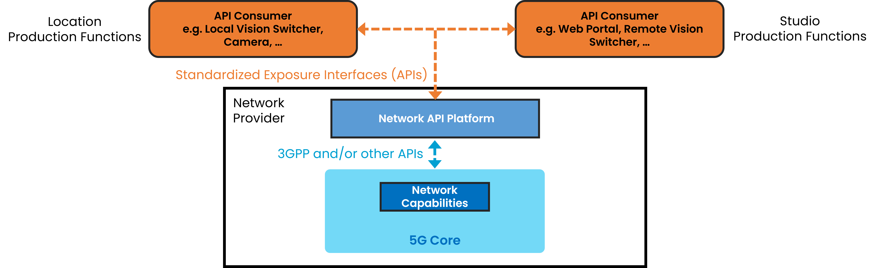
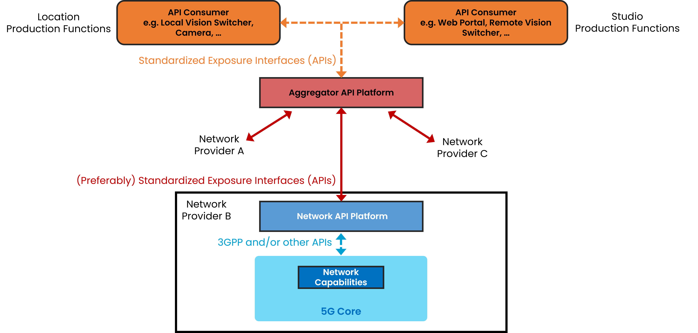

{: .warning }
This documentation is currently **under development and subject to change**. It reflects outcomes elaborated by 5G-MAG members as part of **WI: Network Exposure and APIs Supporting Media Services and Applications**
We welcome and encourage contributions from the broader community. If you are interested in becoming a member of the 5G-MAG and actively participating in shaping this work, please contact the [Project Office](https://www.5g-mag.com/contact)

# Network Capability Exposure and APIs for Content Production and Contribution
The exposure of network capabilities to applications representes an opportunity to exploit advanced network features beyond best-effort connectivity. Examples of network capabilities maz include on-demand quality, user equipment (UE) management, precise time synchronization,... Accessing and utilizing the desired features can be intricate and inconsistent across different networks. Several initiatives are taking shape to explore the opportunities behind Network APIs (exposing network capabilities to API consumers), offering high-level abstractions of underlying network functionalities to simplify resource utilization for non-network experts.

Use cases identified in [Towards a comprehensive 5G-based toolbox for live media production](https://www.5g-mag.com/post/towards-a-comprehensive-5g-based-toolbox-for-live-media-production) that may benefit from specific network capabilities beyond best-effort connectivity include professional electronics newsgathering (ENG), live streaming contribution and media production applications. This documentation identifies a series of requirements, processes and collaboration scenarios related to the exposure of network capabilities to applications.

## Newsgathering and mobile journalism

### Description

A journalist in the field or at a venue is capturing and contributing (uplinking) content to an application server located in the cloud or remote premises.
The content is delivered using one of the following solutions:

  - A single UE (e.g. a smartphone) equipped with a single SIM card (or eSIM) connected to the mobile network.

  - A single device (e.g. a smartphone) with 2 UE each with 1 SIM card (or eSIM) connected to a different carrier of the same mobile network or connected to different mobile networks. Note that multi-SIM devices enable users to utilize multiple cellular connections simultaneously. Dual-SIM Dual-Active or DSDA enable this use case with two SIM cards. This is different to Dual-SIM Dual-Standby (DSDS), which allows only one SIM to stay connected with active data at a time. 
5G DSDA enhances data performance for end users by enabling the use of two data connections concurrently across SIM1 and SIM2, with the option to choose the best of them or aggregate both, if necessary, to reach higher data throughput.

  - A device with multiple UEs (e.g. a cellular bonding backpack) equipment with multiple SIM cards each one connected to a different carrier of the same mobile network or connected to different mobile networks.

{: .note }
A single UE with 2 SIMs or 2 UEs and 2 SIMs? (In principle 2 UEs and 2 SIMs within a single device) - With DSDA: 2 parallel data sessions.
Improve cellular bonding for smartphone - it is unclear if cellular bonding is supported in a smartphone. ATSSS (3GPP + non-3GPP) is within the scope of a single operator. 3GPP+3GPP is not in the scope of ATSSS.

### Actors involved
The actors involved are:
  - Streamer/Creator/Crew, uses the content acquisition equipment to capture media, uses the network and sends data to the server.
  -	a Studio Production Manager, who is located e.g. within the production centre.
  -	Network operator, provides the network used for the production. A set of Network Capabilities can be configured through APIs. The set of offered APIs are called Network APIs in the following.
  -	Aggregator (optional), provides access to different Network Operators. See [GSMA Open Gateway](https://www.gsma.com/solutions-and-impact/gsma-open-gateway/) and [GSMA Operator Platform](https://www.gsma.com/solutions-and-impact/technologies/networks/operator-platform-hp/). 

Network and Application Functions involved:
  -	Production Device (not depicted), used by the Streamer/Creator. The device contains at least one UE with a Subscription (SIM) and can host one or more client applications. A client application can be a video capturing and encoding application, which generates and sends a continuous video stream to a receiving Media Server. 
  -	Network API Platform, used by the Network Operator for exposing Network Capabilities. The Network API Platform offers a collection of functions e.g. for Authentication / Authorization of the API Invoker (AuthZ Function) and different API Provider functions for different network capabilities. Beside this, there may be more functions, e.g. for API usage metering, API usage throttling, etc.
  -	Aggregator API Platform (optional) is located in the path between the Network API Platforms and the API Invoker. It grants access to Network API Platforms from different Network Providers. 
  -	API Consumer / Invoker, used by the Production equipment (functions) to interact with the Network API Platform of a Network Provider.    
  -	Media Servers (not depicted) are typically located in the Studio Production Hub (operated by the Production Manager) and interact with the production devices, e.g. receiving video or audio streams.

## Outside Broadcast

### Description

A production crew deployed in the field or at a venue is capturing and contributing (uplinking) content to an application server located in the cloud or remote premises. This scenario may involve two different cases:

  - A network deployed in the field or at a venue that is used to connect devices and manage the production locally. The final program output may be generated locally and delivered to the production centre using one of the options described in the "newsgathering and mobile journalism" scenario, for instance, by means of a device connected to a mobile network. (NOTE: SNPN + PNI-NPN / fixed - for the uplink we go for Scenario 1).

  - Devices are connected to the public network with the production managed remotely and multiple devices contributing data to the production centre.

Multiple devices are concurrently used during the production. Not all data flows have the same priority and quality requirements. Therefore, each device and data flow should get the requested connectivity performance (e.g. throughput, latency, jitter,...) and with the desired QoS, which may change for each device and data flow during the production. (NOTE: Add text referring to PNI-NPN - this scenario is more relevant for network APIs)

### Actors involved
The actors involved are:
  -	Production manager deals with the configuration of the production equipment and the access network and has the authority to use the application that interacts with the network operator. There can be either: 
    -	a Location Production Manager, who is together with the Production Crew in the field, or
    -	a Studio Production Manager, who is located e.g. within the production centre.

  - Streamer/Creator/Crew, uses the content acquisition equipment to capture media, uses the network and sends data to the server.
  -	Network operator, provides the network used for the production. A set of Network Capabilities can be configured through APIs. The set of offered APIs are called Network APIs in the following.
  -	Aggregator (optional), provides access to different Network Operators. See [GSMA Open Gateway](https://www.gsma.com/solutions-and-impact/gsma-open-gateway/) and [GSMA Operator Platform](https://www.gsma.com/solutions-and-impact/technologies/networks/operator-platform-hp/). 

Network and Application Functions involved:
  -	Production Device (not depicted), used by the crew during a production. Each device contains at least one UE with a Subscription (SIM) and can host one or more client applications. A client application can be a video capturing and encoding application, which generates and sends a continuous video stream to a receiving Media Server. 
  -	Network API Platform, used by the Network Operator for exposing Network Capabilities. The Network API Platform offers a collection of functions e.g. for Authentication / Authorization of the API Invoker (AuthZ Function) and different API Provider functions for different network capabilities. Beside this, there may be more functions, e.g. for API usage metering, API usage throttling, etc.
  -	Aggregator API Platform (optional) is located in the path between the Network API Platforms and the API Invoker. It grants access to Network API Platforms from different Network Providers. 
  -	API Consumer / Invoker, used by the Production equipment (functions) to interact with the Network API Platform of a Network Provider.    
  -	Media Servers (not depicted) are typically located in the Studio Production Hub (operated by the Production Manager) and interact with the production devices, e.g. receiving video or audio streams.

## Collaboration scenarios for the provisioning of network capabilities

### Collaboration scenario #1: Direct invoking Network APIs
The Network API Platform of a Network Provider is accessed directly from API Consumers, either deployed with the Studio Production or the Location Production functions. The API consumer can be a Web Portal, e.g. offered by the CSP. Alternatively, the API consumers can be embedded production devices like a Vision Mixer or a production orchestration solution ([NMOS](https://specs.amwa.tv/nmos/branches/main/docs/Technical_Overview.html)  concept). The API consumer functions can be integrated in media servers, responsible for receiving the video stream from the application client.

### Collaboration scenario #2: Invoking Network APIs via an Aggregator
The Network API Platform of a Network Provider is accessed via an Aggregator API Platform. The Aggregator Platforms harmonize capabilities offered by different Network Providers and routes customer requests to them.

