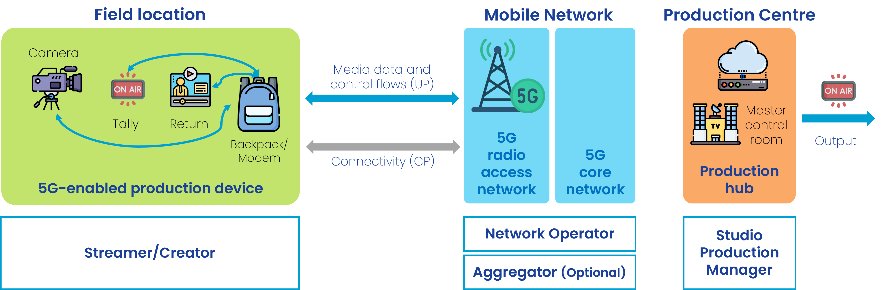

 

{: .warning }
This documentation is currently **under development and subject to change**. It reflects outcomes elaborated by 5G-MAG members. If you are interested in becoming a member of the 5G-MAG and actively participating in shaping this work, please contact the [Project Office](https://www.5g-mag.com/contact)

1. TOC
{:toc}

# Network Capability Exposure and APIs for Content Production and Contribution

Wireless connectivity plays a key role in content production and contribution scenarios such as production in studios, coverage of live in-venue (a football match) or on-the-move (the Tour-de-France) events, commentary stands (in a convention), newsgathering (breaking news in the street),...

These different setups may have unique infrastructure and equipment needs, and the provision of connectivity with variyng QoS requirements.

The use of wireless connectivity may differ as a trade-off between quality (or importance) of the content and connection reliability.

## A few key ideas, practical examples and trade-offs

The choice to use wireless connectivity is not limited to specific scenarios or production levels. Instead, it is a strategic trade-off, balancing cost, tolerance for technical glitches, risk of failure, and the quality and importance of the content. Examples are given below.

### Diversity in connectivity needs in the same deployment scenario

Media production scenarios often require a mix of connectivity solutions to meet a variety of needs. For example, during a football match, a production team uses high-quality cameras for the main broadcast, while a commentator stand might have additional wireless cameras for pre-game interviews. Wireless cameras are also deployed outside the stadium to capture interviews with the crowd at the entrance of the stadium.

Similarly, a major event like the coronation of King Charles III brought together numerous TV producers. They used a combination of dedicated, high-quality streams for the main ceremony and various other setups for newsgathering and interviews from journalists deployed around the site. This demonstrates how a single event can have multiple connectivity needs, from high-bandwidth main broadcasts to more flexible, on-the-go reporting. This is independent of the overall cost or budget of the whole event.

### Immediacy Over Quality

When a sudden street event unfolds, the only way to cover it is with smartphones on a best-effort connection. Getting any live footage is far more valuable than dismissing the connection due to its unreliability. 
While the video might not be broadcast-quality, the immediate, raw footage from the scene is critical for covering the event as it happens.

### Agility over Cost

For both sudden and partially-planned events, cellular bonding systems have emerged as cost-effective solutions to eliminate the need for e.g. dedicated satellite feeds, making live reporting from a wider range of locations economically viable. The equipment itself may be a major investment. The backpacks, modems, and SIM cards are not inexpensive and the news organization has to pay for a data plan for each SIM card and a service fee to the external company that provides the bonding infrastructure.

Cellular bonding is needed as a single best-effort public mobile network cannot guarantee reliability. The news organization will plan where to send the different journalists that will provide reports from remote locations during the news programme. Covering sudden events with cellular bonding equipment is also usual, which may achieve better reliability that the connectivity via a single smartphone.

### Dynamic Footage over Signal Stability

High-mobility cameras introduce the unique challenge of seamlessly mixing their footage (generally highly engaging) into a high-quality production that includes wired cameras with reliable connections. This means the wireless setup needs to be as stable as possible, whereas the nature of its constant motion, changing environments, and potential signal obstructions makes that challenging with frequent signal fades or brief drops in connectivity.

Despite these issues, the value of the unique camera perspective is prioritized. A camera on a referee provides an on-field view of the action and is critical for live replays and enhancing the narrative of the game. A camera on a motorbike in the Tour de France provides up-close views of the riders that a stationary camera could never capture.

## Beyond best-effort connectivity: exposure of network capabilities

The fundamental trade-off in using wireless connectivity for media is that as a connection becomes more reliable, it enables more high-quality content to be delivered on it.
Historically, media was uplinked using highly reliable satellite and RF technologies. Today, the widespread availability of public mobile networks or LEO satellite constellations triggered a shift toward more agile tools like smartphones, cellular bonding packs or wireless modems. 

The exposure of network capabilities to applications representes an opportunity to exploit advanced network features beyond best-effort connectivity. Examples of network capabilities maz include on-demand quality, user equipment (UE) management, precise time synchronization,... Accessing and utilizing the desired features can be intricate and inconsistent across different networks. Several initiatives are taking shape to explore the opportunities behind Network APIs (exposing network capabilities to API consumers), offering high-level abstractions of underlying network functionalities to simplify resource utilization for non-network experts.

## Media connectivity flows: Single device connectivity

### Descriptive example: Mobile journalism and newsgathering

A journalist in the field or at a venue is capturing and contributing (uplinking) content to an application server located in the cloud or remote premises.
The content is delivered using one of the following options:

  - A single UE (e.g. a smartphone) equipped with a single SIM card (or eSIM) connected to the mobile network.

  - A single device (e.g. a smartphone) equipped with 2 UEs each with 1 SIM card (or eSIM) connected to a different carrier of the same mobile network or different mobile networks. Note that multi-SIM devices enable users to utilize multiple cellular connections simultaneously. Dual-SIM Dual-Active (DSDA) enable this use case with two SIM cards. This is different to Dual-SIM Dual-Standby (DSDS), which allows only one SIM to stay connected with active data at a time. DSDA enhances data performance for end users by enabling the use of two data connections concurrently across SIM1 and SIM2, with the option to choose the best of them or aggregate both, if necessary, to reach higher data throughput.

  - A device with multiple UEs (e.g. a cellular bonding backpack) equipment with multiple SIM cards each one connected to a different carrier of the same mobile network or connected to different mobile networks.

The actors involved are:
  - **Streamer/Creator**, uses the content acquisition equipment to capture media, uses the network and sends data to the server.
  -	a **Studio Production Manager**, located e.g. within the production centre.
  -	**Network Operator**, provides the network used for the production. A set of network capabilities can be configured through APIs (referred to as Network APIs in the following).
  -	**Aggregator (optional)**, provides access to the network capabilties of different Network Operators. See [GSMA Open Gateway](https://www.gsma.com/solutions-and-impact/gsma-open-gateway/) and [GSMA Operator Platform](https://www.gsma.com/solutions-and-impact/technologies/networks/operator-platform-hp/) as examples.

The network functions and applications involved are:
  -	**Production Device** (such as a smartphone or a camera attached which is connected to a modem or a backpack), used by the streamer/creator. The device contains at least one UE with a Subscription (SIM) and can host one or more client applications. A client application can be a video capturing and encoding application, which generates and sends a continuous video stream to a receiving Media Server. 
  -	**Network API Platform**, used by the Network Operator for exposing network Capabilities. The Network API Platform offers a collection of functions e.g. for Authentication / Authorization of the API Invoker (AuthZ Function) and different API Provider functions for different network capabilities. Beside this, there may be more functions, e.g. for API usage metering, API usage throttling, etc.
  -	**Aggregator API Platform (optional)**, located in the path between the Network API Platforms and the API Invoker. It grants access to Network API Platforms from different Network Providers. 
  -	**API Consumer / Invoker**, used by the Production equipment (functions) to interact with the Network API Platform of a Network Provider.    
  -	**Media Servers**, typically located in the Studio Production Hub (operated by the Production Manager) and interact with the production devices, e.g. receiving video or audio streams.

## Media connectivity flows: Multi-device connectivity

### Descriptive example: Outside Broadcast

A production crew deployed in the field or at a venue is covering an event using multiple devices including cameras, audio equipment, intercom, etc. Multiple devices are concurrently used during the production. Not all data flows have the same priority and quality requirements. Therefore, each device and data flow should get the requested connectivity performance (e.g. throughput, latency, jitter,...) and with the desired QoS, which may change for each device and data flow during the production.
Two options are considered when it comes to network deployment:

- A network deployed in the field or at a venue that is used to connect devices and manage the production locally. Devices capturing and contributing (uplinking) content deliver it to an application server located in the cloud or in the field location. The final program output may be generated locally and delivered to the production centre using one of the options described in the "newsgathering and mobile journalism" scenario, for instance, by means of a device connected to a mobile network. The scenario may involve the deloyment of different networks:
    - An SNPN, deployed locally. Remote connectivity can be provided by means of a fiber connection or a public network (PNI-NPN) to which the SNPN is connected to. However, the networks are detached and traffic from devices is not directly contributed but only the program output.
    - A PNI-NPN which provides dedicated connectivity locally and for the production devices.

- A public network to which devices are connected to. Devices are managed remotely and are contributing data to the production centre. In this case, a PNI-NPN may be used to guarantee QoS for the different flows carried across the mobile network.

The actors involved are:
  -	A **Production Manager**, deals with the configuration of the production equipment and the access network and has the authority to use the application that interacts with the network operator. It is either: 
    -	a Location Production Manager, who is together with the Production Crew in the field, or
    -	a Studio Production Manager, who is located e.g. within the production centre.

  - **Streamer/Creator/Crew**, uses the content acquisition equipment to capture media and the network to send data to the server.
  -	**Network Operator**, provides the network used for the production. A set of network capabilities can be configured through APIs (referred to as Network APIs in the following).
  -	**Aggregator (optional)**, provides access to the network capabilties of different Network Operators. See [GSMA Open Gateway](https://www.gsma.com/solutions-and-impact/gsma-open-gateway/) and [GSMA Operator Platform](https://www.gsma.com/solutions-and-impact/technologies/networks/operator-platform-hp/) as examples.

The network functions and applications involved are:
  -	**Production Devices** (such as a Camera), used by the crew during a production. Each device contains at least one UE with a Subscription (SIM) and can host one or more client applications. A client application can be a video capturing and encoding application, which generates and sends a continuous video stream to a receiving Media Server. 
  -	**Network API Platform**, used by the Network Operator for exposing network Capabilities. The Network API Platform offers a collection of functions e.g. for Authentication / Authorization of the API Invoker (AuthZ Function) and different API Provider functions for different network capabilities. Beside this, there may be more functions, e.g. for API usage metering, API usage throttling, etc.
  -	**Aggregator API Platform (optional)**, located in the path between the Network API Platforms and the API Invoker. It grants access to Network API Platforms from different Network Providers. 
  -	**API Consumer / Invoker**, used by the Production equipment (functions) to interact with the Network API Platform of a Network Provider.    
  -	**Media Servers**, typically located in the Studio Production Hub (operated by the Production Manager) and interact with the production devices, e.g. receiving video or audio streams.

## Network capabilities: Collaboration scenarios

### Collaboration scenario #1: Direct invoking Network APIs
The **Network API Platform** of a Network Operator is accessed directly from **API Consumers**, either deployed with the Studio Production or the Location Production functions. The API consumer can be a Web Portal, e.g. offered by the CSP. Alternatively, the API consumers can be embedded production devices like a Vision Mixer or a production orchestration solution ([NMOS](https://specs.amwa.tv/nmos/branches/main/docs/Technical_Overview.html)  concept). The API consumer functions can be integrated in media servers, responsible for receiving the video stream from the application client.

### Collaboration scenario #2: Invoking Network APIs via an Aggregator
The **Network API Platform** of a Network Operator is accessed via an **Aggregator API Platform**. The Aggregator Platforms harmonize capabilities offered by different Network Providers and routes customer requests to them.

