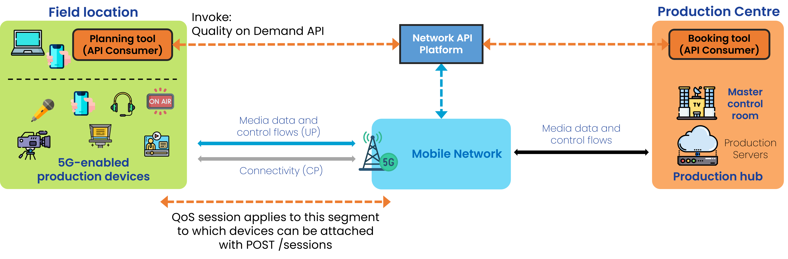
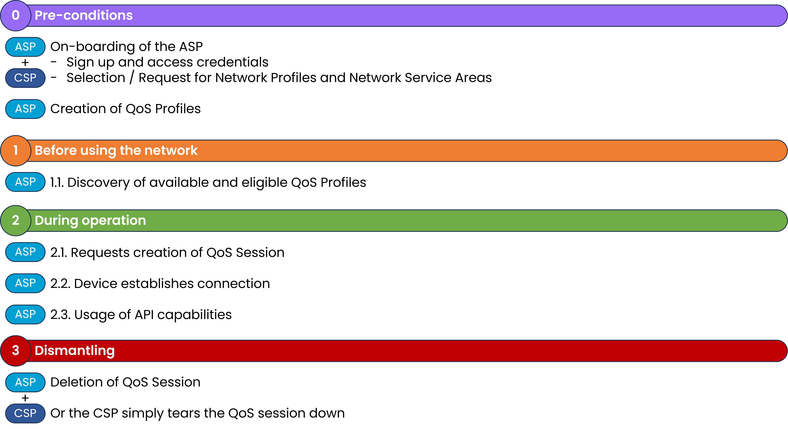

 

{: .warning }
This documentation is currently **under development and subject to change**. It reflects outcomes elaborated by 5G-MAG members. If you are interested in becoming a member of the 5G-MAG and actively participating in shaping this work, please contact the [Project Office](https://www.5g-mag.com/contact)

# Using CAMARA APIs: Quality on Demand for Content Production & Contribution

Find more information about [**QoD API**](../CAMARA_QualityonDemand.html).

A user of a media application would like to request the creation of a QoS session for the connection between a device and an application server.

# Workflow and Architecture

This is a high-level figure with the entities involing APIs and the devices involved:

<figure>
  
</figure>

## General Workflow

The following steps are executed:

<figure>
  
</figure>

## Step 0: Pre-conditions
* The API invoker needs to have signed up with the API provider.
* qosProfiles have already been defined and made available by the network operator.
* Names of such qosProfiles have been disclosed to the user so they can be used when invoking APIs.

## Step 1: Before using the network
Details of the already arranged QoS Profile can be retrieve with **GET /qos-profiles/{name}**.

An example of the QoS Profile, including status:

```
[
  {
    "name": "voice",
    "description": "QoS profile for video streaming",
    "status": "ACTIVE",
    "targetMinUpstreamRate": {
      "value": 10,
      "unit": "bps"
    },
    "maxUpstreamRate": {
      "value": 10,
      "unit": "bps"
    },
    "maxUpstreamBurstRate": {
      "value": 10,
      "unit": "bps"
    },
    "targetMinDownstreamRate": {
      "value": 10,
      "unit": "bps"
    },
    "maxDownstreamRate": {
      "value": 10,
      "unit": "bps"
    },
    "maxDownstreamBurstRate": {
      "value": 10,
      "unit": "bps"
    },
    "minDuration": {
      "value": 12,
      "unit": "Days"
    },
    "maxDuration": {
      "value": 12,
      "unit": "Days"
    },
    "priority": 20,
    "packetDelayBudget": {
      "value": 12,
      "unit": "Days"
    },
    "jitter": {
      "value": 12,
      "unit": "Days"
    },
    "packetErrorLossRate": 3,
    "l4sQueueType": "non-l4s-queue",
    "serviceClass": "real_time_interactive"
  }
]
```

## Step 2: During operation

### 2.1 Requests creation of QoS session

With **POST /sessions** passing the `device` object, `applicationServer` IP, `applicationServerPorts`, `devicePorts`, `qosProfile` and `duration`.

### 2.2 Device establishes connection

### 2.3 Usage of API capabilities

A series of operations to delete the QoS session or extending its duration are available:

**GET /sessions/{sessionId}** - Get QoS session information
**DELETE /sessions/{sessionId}** - Delete a QoS session
**POST /sessions/{sessionId}/extend** - Extend the duration of an active session
**POST /retrieve-sessions** - Get QoS session information for a device

## Step 3: Dismantling

When reaching the duration the QoS session may be teared down. A greceful way of tearing down will delete the QoS session by `id`.
**DELETE /sessions/{sessionId}** deletes a QoS session

---

## 5G-MAG's Self-Assessment

A session may be created by establishing a level of QoS between the device and the application server for a given duration. It is assumed that the QoS Provisioning would result successful when invoked in the given location. However as a service area cannot be defined/requested, it is unclear whether this would be successful or not.

Potential improvements:
- There is no information about the location or service area.
- Understanding opportunities to book QoS sessions in terms of duration and location/area would be useful as the user may be able to move and find a better coverage spot rather than being denied the establishment of QoS at the time and location in which it is requested.
