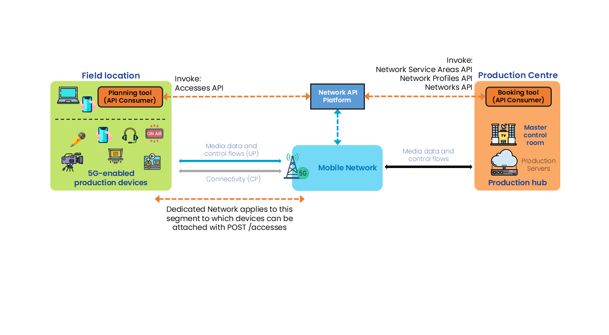
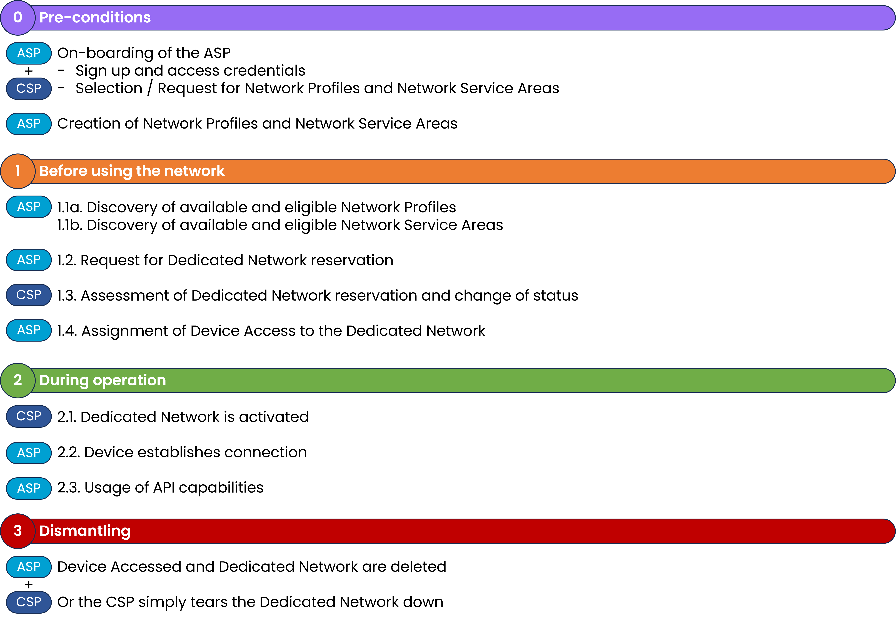

 

{: .warning }
This documentation is currently **under development and subject to change**. It reflects outcomes elaborated by 5G-MAG members. If you are interested in becoming a member of the 5G-MAG and actively participating in shaping this work, please contact the [Project Office](https://www.5g-mag.com/contact)

# Using CAMARA APIs: Quality on Demand for Content Production & Contribution

Find more information about [**QoD API**](../CAMARA_QualityonDemand.html).

A user of a media application would like to request a QoS Session, with a set of capabilities and connectivity performance targets. The resut is for a particular geographical location and at a particular time window. The following steps are executed:

# Workflow and Architecture

<figure>
  
</figure>

## General Workflow

<figure>
  
</figure>

## Step 0: Pre-conditions
* qosProfiles have already been defined and made available by the network operator. This is related to the [**QoS Profiles API**](./CAMARA_QosProfiles.html).
* Network Profiles with the allowed number of devices which can be served concurrently together with the aggregated UL and DL throughput have been defined and made available by the network operator.
* Dedicated Network Service Areas are created by the operator and made available.

## Step 1: Before using the network

### 1.1a. Discovery of available and eligible Network Profiles:
Usage of **GET /profiles** to obtain a list of dedicated network profiles with the corresponding **"id": "string"**.

```
[
  {
    "id": "string",
    "maxNumberOfDevices": 0,
    "aggregatedUlThroughput": {
      "value": 10,
      "unit": "bps"
    },
    "aggregatedDlThroughput": {
      "value": 10,
      "unit": "bps"
    },
    "qosProfiles": [
      "QCI_1_voice"
    ],
    "defaultQosProfile": "QCI_1_voice"
  }
]
```

### 1.1b. Discovery of available and eligible Network Service Areas:
The ASP should create and object with the desired location by means of one of the following parameters:

```
{
  "atLocation": {
    "latitude": 50.735851,
    "longitude": 7.10066
  },
  "overlappingArea": {},
  "coveringArea": {},
  "byName": "string",
  "byNetworkProfileId": "string",
  "byQosProfileName": "QCI_1_voice"
}
```

This object is passed as a body for **POST /retrieve-service-areas**.

This operation should return an **"id": "string"**, in this form:

```
[
  {
    "id": "3fa85f64-5717-4562-b3fc-2c963f66afa6",
    "name": "string",
    "description": "string",
    "area": {},
    "networkProfiles": [
      "string"
    ],
    "qosProfiles": [
      "QCI_1_voice"
    ]
  }
]
```

### 1.2: Request for Dedicated Network reservation
Usage of  **POST /networks** passing a `profileId`, `serviceTime`, `serviceAreaId`, among others, in the following form:

```
{
  "profileId": "string",
  "serviceTime": {
    "start": "2025-11-05T14:14:35.390Z",
    "end": "2025-11-05T14:14:35.390Z"
  },
  "serviceArea": {},
  "sink": "https://1IG+u7oa.fNS?9-`Zg`Fi*'k",
  "sinkCredential": {}
}
```

The response should contain a **"status": "REQUESTED"**.

### 1.3 Assessment of Dedicated Network reservation and change of status

During this phase, **GET /networks** may be used to list the information on the dedicated networks and their status.

### 1.4 Assignment of Device Access to the Dedicated Network

**POST /accesses** should be used to attach devices to a dedicated network:

```
{
  "networkId": "3fa85f64-5717-4562-b3fc-2c963f66afa6",
  "device": {
    "phoneNumber": "+123456789",
    "networkAccessIdentifier": "123456789@domain.com",
    "ipv4Address": {
      "publicAddress": "84.125.93.10",
      "publicPort": 59765
    },
    "ipv6Address": "2001:db8:85a3:8d3:1319:8a2e:370:7344"
  },
  "qosProfiles": [
    "string"
  ],
  "defaultQosProfile": "string"
}
```

## Step 2: During operation

### 2.1 Dedicated Network is activated

**GET /networks** may be used to list the information on the dedicated networks and their status.

### 2.2 Device establishes connection

### 2.3 Usage of API capabilities

A series of operations to assign new devices and de-assign existing ones can be performed while the Dedicated Network is active via:

**POST /accesses** with the request body including the networkId received after invoking the Dedicated Network API (id), a device object, qosProfiles, this request will crate a device access to a dedicated network with a given configutation. The response includes an id.

**DELETE /accesses/{accessId}** to delete a device access to the dedicated network.

## Step 3: Dismantling

When reaching the duration the Dedicated Network may be teared down. A greceful way of tearing down will delete device accesses and dedicated networks by `id`.
**DELETE /accesses/{accessId}** deletes a device access to the dedicated network
**DELETE /networks/{networkId}** deletes a dedicated network

# 5G-MAG's Self-Assessment

The Profiles and Networks APIs are to be invoked before the actual usage of the network to ensure that the requested capabilities are "reserved" for the specific area and time window.
During the event devices will have access to the Dedicated Network and should be allocated or de-allocated depending on the actual requirements.
This API is certainly adequate for a simple use case of 1 device requesting connectivity (MoJo) or multiple devices taking part in a Media Production setup.

What is the meaning of `maxNumberOfDevices`? An ideal situation would be to bring different devices to an event (including for backup) which are candidates to be assigned to a dedicated network. During operation only a maximum amount of devices can concurrently connect to the network and allocated resources accoding to the network profile.

One of the most interesting features in this API is the ability to define and create the network profile and later on attach/detach a device. This adds flexibility and avoids losing the dedicated resources when revoking a device.

Potential improvements:
- there is a dependency with qosProfiles and Network Profiles, which need to be present before being able to invoke Dedicated Networks. This is not an issue related to this API but worth considering as it would be useful if such profiles could be created/requested by the user and accepted by the network operator, rather than requiring another process.
