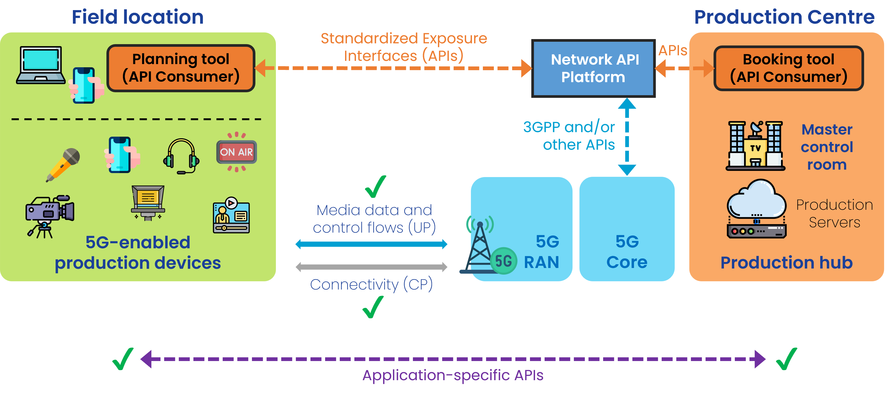
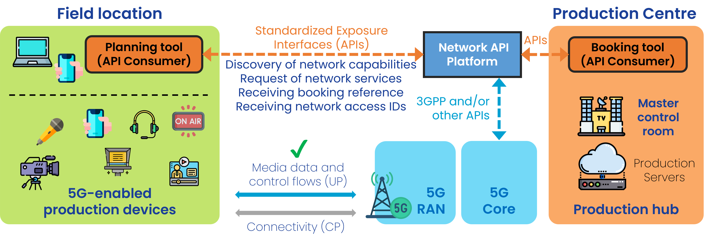
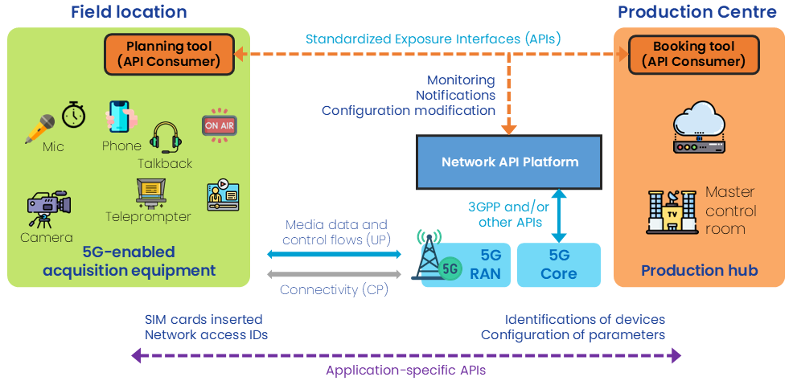

 

{: .warning }
This documentation is currently **under development and subject to change**. It reflects outcomes elaborated by 5G-MAG members. If you are interested in becoming a member of the 5G-MAG and actively participating in shaping this work, please contact the [Project Office](https://www.5g-mag.com/contact)

# Workflows and Requirements for Content Production & Contribution

[Scenarios and Use Cases](../Production_Contribution_Scenarios.html) describe two reference scenarios. The workflows in relation to the booking and usage of network capabilities are described here with a focus on quality of service (QoS).

This section contains information on:
* [**Pre-conditions and commnalities**](#introduction)
* [**Workflow for Single-device Connectivity**](#single-device-connectivity-single-camera-live-video-production-mobile-journalism-mojo-newsgathering-uplink-video)
* [**Workflow for Multi-device Connectivity**](#multi-device-connectivity-outside-broadcast-small-scale-video-production-remote-production)
* [**Dynamic management of network capabilities during runtime**](#dynamic-management-of-network-capabilities-during-runtime)

# Pre-conditions and commonalities

Before invoking any API, it is assumed that:

* The production crew has a set of credentials (SIM/eSIM) for the network device nodes will connect to.
* By default, the network provides "best-effort" connectivity and devices can already exploit "best-effort" connectivity.
* The production company has set up an agreement with a network operator for usage of certain **network capabilitues** made available via an API. The production crew has obtained key access tokens/keys/credentials/payment details in advance authorising their use (when available).
* The production crew (on location or located in the production centre) has access to one or more **Network API Platforms**. These platforms are accessible by any device/connectivity (e.g. Internet-accessible website portal, command line tools, dedicated application, etc.).
* API Consumers will be able to select from available profiles, service areas, and parameters offered by the API Provider.

## Single-device Connectivity (Single Camera Live Video Production, Mobile Journalism (MoJo), Newsgathering, Uplink Video)

## Before the Event

### Phase A: Preparing devices, configuring application clients and servers, and configuring client/server flows

* Production device nodes are generally UEs which establish connectivity to servers in the Data Network. 
* An **application-specific API** (e.g. from the media equipment provider) enables client/server communication to configure media-related parameters and procedures.

<table>
  <tr>
    <td markdown="span" align="left"><b>Practical example<b/></td>
  </tr>
  <tr>
    <td markdown="span" align="left">A typical setup can consist of a smartphone used to capture video which is then send to a server in the cloud for uplink streaming. The provider of such a service, or the user, would have configured the IP addresses, ports, and other parameters between the user application and the application server through such application-specific API. For a cellular backpack, a similar configuration should be followed.</td>
  </tr>
</table>

### Phase B: Event planning and pre-booking

Through the Network API Platform:
1. The production crew (already on location or while traveling to the event) can discover the capabilities the network can offer in a particular location and at a particular time (for which the production company is eligible for). Example: QoD available, connectivity monitoring available.
2. The production crew requests network services for the devices (identified by its SIM cards) in advance. The booking of resources is done based on:
  * Geographical area
  * Schedule (starting time and closing time, or duration, of the event)
3. The production manager receives a booking reference responding to the service request.
4. The production manager accepts the service booking offer (involving payment).
5. The production manager receives **network access IDs** to be used by the production device UEs to access the network and the requested capabilities for the specified location and duration.
    * Each network access ID ultimately resolves to a Data Network Name (DNN) and optionally a network slice identifier (S-NSSAI).

<table>
  <tr>
    <td markdown="span" align="left"><b>Practical example<b/></td>
  </tr>
  <tr>
    <td markdown="span" align="left">This should be seen as nothing very different to going to the portal of your network operator to e.g. add a bonus for more data, activate/deactivate roaming opetions, and other services within your existing contract. If the contract includes the ability to select extra connectivity services (e.g. Quality of Service) those should be selectable from such or a similar portal.</td>
  </tr>
</table>
     
## During the event

### Phase C: Configuration and Usage of the network capabilities
1. The production crew arrives at the event and can start using the booked network services (See phase B).
2. The production device makes use of the network capabilities according to the network access IDs reveived. The media related parameters can be adapted using an application-specific API, citing the network access IDs delivered in step B.5).

<table>
  <tr>
    <td markdown="span" align="left"><b>Practical example<b/></td>
  </tr>
  <tr>
    <td markdown="span" align="left">In a typical scenario, the journalist arrives to the location where the uplink video contribution should start. The network desired network conditions can be checked and booked on the spot so the transmission can start with the desired QoS. If known in advanced, the booking may have been done before arriving to the event. If network conditions are guaranteed (i.e. the booked service is being used), the media flow can be optimized by passing the details to the media application. For instance, if the network is able to guarantee X Mbps, the user can configure an encoder so it stays within margins avoiding packet loss.</td>
  </tr>
</table>
     
## After the event

### Phase D: Location teardown
1. Through the Network API Platform, the production crew releases the booked resources when the event finishes.

---

## Multi-device connectivity (Outside Broadcast, Small-Scale Video Production, Remote Production)

## Before the Event

### Phase A: Preparing devices, configuring application clients and servers, and configuring client/server flows

* Some production device nodes are UEs; others are connected to the Data Network:
  * Example production device nodes connected to the RAN: wireless cameras, wireless camera control units, wireless microphones, wireless talkback intercom, etc.
  * Example production device nodes connected to the Data Network: vision mixer, sound mixer, etc. 
* An **application-specific API** (e.g. from the media equipment provider) enables communication between the production network orchestrator and the production device nodes to configure media-related parameters and procedures.

<table>
  <tr>
    <td markdown="span" align="left"><b>Practical example<b/></td>
  </tr>
  <tr>
    <td markdown="span" align="left">A typical setup can consist of several cameras, intercom, video return, mixers,... all interconnected and/or providing content to e.g. a vision mixed in the cloud. Connectivity should be established for all the equipment, which configuration is done via the application-specific API.</td>
  </tr>
</table>

### Phase B: Event planning and pre-booking

Through the Network API Platform:
1. The production crew (on location or from the production centre) can discover the capabilities the network can offer in a particular location and at a particular time (for which the production company is eligible for). Example: QoD available, connectivity monitoring available, Timing as a service available, edge compute instantiation, etc.

2. The production crew requests network services for the devices (identified by its SIM cards) in advance. Possible services (network capabilities) are:
   1. *Quality-on-Demand*
      * One or several QoS profiles for each SIM card (QoS profiles are mapped to 5QIs) 
      * Example: A sim may be pre booked for one uplink video / one uplink audio / one downlink data / etc.
   2. *Time-as-a-service*
      * Provided either by access stratum or Precision Time Protocol (PTP).
  
   The booking of resources is done based on:
      * Geographical area
      * Schedule (starting time and closing time, or duration, of the event)
        
3. The production manager receives a booking reference responding to the service request.
4. The production manager accepts the service booking offer (involving payment/contract/SLA aspects).
5. The production manager receives **network access IDs** to be used by the production device UEs to access the network and the requested capabilities for the specified location and duration.
    * Each network access ID ultimately resolves to a Data Network Name (DNN) and optionally a network slice identifier (S-NSSAI).

<table>
  <tr>
    <td markdown="span" align="left"><b>Practical example<b/></td>
  </tr>
  <tr>
    <td markdown="span" align="left">This should be seen as nothing very different to going to the portal of your network operator to e.g. add a bonus for more data, activate/deactivate roaming opetions, and other services within your existing contract. If the contract includes the ability to select extra connectivity services (e.g. Quality of Service) those should be selectable from such or a similar portal. For a planned event taking place at a known location and for a given duration, the booking of network resources can be done beforehand by indicating the requirements, number of devices, QoS requirements for each of the devices or a group of them,...</td>
  </tr>
</table>

## During the event

### Phase C: Configuration and Usage of the network capabilities
1. The production crew arrives in the venue, plugs the SIM cards and turn on the devices, connectivity is enabled based on the booked network services (See phase B).
2. The production crew initiates the setup of the location production by interacting with the production network orchestrator.
3. The production network orchestrator configures the production device nodes using an application-specific API, citing the network access IDs delivered in step B.5).

   * Example: QoD service: A camera for which  one video + one audio is pre-booked. The application-specific API is used to properly configure the bitrate of the audio and video output, and the provided IDs.
   * Example: Time Sync service: A camera for which access to global clock is requested. The application-specific API is used to properly configure the time parameters and the provided IDs.

4. The production device makes use of the network capabilities according to the network access IDs reveived.

<table>
  <tr>
    <td markdown="span" align="left"><b>Practical example<b/></td>
  </tr>
  <tr>
    <td markdown="span" align="left">Once at the location, connectivity needs to be established among the devices. Once this is ready, the setup will have the ability to exploit the pre-booked network resources.</td>
  </tr>
</table>

Note: the steps in phase C are repeated whenever a service is added and created from scratch.
 
## After the event

### Phase D: Location teardown
1. Through the Network API Platform, the production crew releases the booked resources when the event finishes.

# Dynamic management of network capabilities during runtime

A series of actions can be expected "During the Event" as changes, reconfiguration or additional requests may need to be processed.

## Monitoring and notifications
* The production crew should use the Network API Platform to monitor that the flows are coming and are properly using the reserved resources.
* The production crew should receive notifications through the Network API Platform indicating potential issues (throughput, delay, etc.).

## Reconfiguration for a given device
* The production crew through the Network API Platform should request a change of the current configuration assinged to a device
* The production crew through the Network API Platform should request an update/modification of the originally booked resources (e.g. increase or decrease the thoughput associated to an existing profile). Same validation steps as from B.2 to B.5 will be conducted after requesting the change. Note that the network access IDs are not expected to change when a reconfiguration occurs.

## Back-up devices
* The production crew through the Network API Platform should switch/update a device while being able to use the original booking of a different device.

## Dynamic prioritization of QoS for different media flows

In a setup with multiple camras, the media producer would like to ensure that there is always a subset of those being prioritized with the highest QoS profile. While each individual camera should be entitled to exploit such high QoS profile (i.e. the original booking should take into account that X devices will be requesting QoS profile Y), not all of them will be using such profile concurrently. Therefore:
* The production crew though the Network API Platform should dynamically attach/detach a device to a QoS profile.
* The network operator should secure that a subset of devices can concurrently request a given QoS profile and that all other devices remain eligible to access such profile when it is no longer used.

### Basic example: Definition of QoS Profiles

A media production requires 4 devices (e.g. cameras, smartphones). The output video quality of the cameras can switch from being "On Air" (high quality video), "Preview" (lower quality video which can quickly scale up when needed to be "On Air"), "Standby" (a minimum quality video for monitoring a scene in a video gallery).

Therefore, first step is to define such QoS profiles which cameras can use.

<table>
  <tr>
    <td markdown="span" align="left"><b>QoS Profile name</b></td>
    <td markdown="span" align="left"><b>Parameters</b></td>
  </tr>
  <tr>
    <td markdown="span" align="left">QoS_OnAir - QoS Profile for High Quality Video</td>
    <td markdown="span" align="left">Uplink throughput = 10 Mbps</td>
  </tr>
  <tr>
    <td markdown="span" align="left">QoS_Preview - QoS Profile for Previw Quality Video</td>
    <td markdown="span" align="left">Uplink throughput = 5 Mbps</td>
  </tr>
  <tr>
    <td markdown="span" align="left">QoS_Standby - QoS Profile for Standby</td>
    <td markdown="span" align="left">Uplink throughput = 2 Mbps</td>
  </tr>
</table>

### Basic example: Identification of elegible devices-profiles

Among the 4 devices:
* Only one device is expected to use the QoS_OnAir profile during runtime. The rest will be either in QoS_Preview or QoS_Standby. When the media producer decides to switch the On-Air camera, there are temporarily two devices assigned with a QoS_OnAir profile.
* Only one device is expected to use the QoS_Preview profile during runtime. The QoS_Preview profile is used for devices, which are about to be switched to the OnAir profile. Typically, the camera operator gets notified with the Preview selection, that its camera is next to be on air.
* Cameras, which are providing their video “just” to the production gallery, are assigned with QoS_Standby profile.

<table>
  <tr>
    <td markdown="span" align="left"><b>Device</b></td>
    <td markdown="span" align="left"><b>Eligible QoS Profiles</b></td>
  </tr>
  <tr>
    <td markdown="span" align="left">Device C1</td>
    <td markdown="span" align="left">QoS_OnAir, QoS_Preview and QoS_Standby</td>
  </tr>
  <tr>
    <td markdown="span" align="left">Device C2</td>
    <td markdown="span" align="left">QoS_OnAir, QoS_Preview and QoS_Standby</td>
  </tr>
  <tr>
    <td markdown="span" align="left">Device C3</td>
    <td markdown="span" align="left">QoS_OnAir, QoS_Preview and QoS_Standby</td>
  </tr>
  <tr>
    <td markdown="span" align="left">Device C4</td>
    <td markdown="span" align="left">QoS_OnAir, QoS_Preview and QoS_Standby</td>
  </tr>
</table>

Note that the intention of this pre-booking is to make sure that 4 devices can be attached to 3 different QoS profiles during runtime. However not all the devices and profiles are used concurrently.

### Basic example: Assignment of QoS Profile during runtime

With the assumptions above:
* The production crew through the Network API Platform should request a change of the assinged device from one QoS profile to another.

From the network resources point of view, there will be:
* A maximum of 2 devices concurrently assigned a QoS_OnAir profile (20 Mbps) plus 2 other devices with the QoS_Standby profile (4 Mbps) - peak throughput is 24 Mbps.
* Most of the time a maximum of 1 device will be assigned a QoS_OnAir profile (10 Mbps) plus 3 other devices with the QoS_Standby profile (6 Mbps) - peak thoughput is 16 Mbps.
* Only when the camera is about to be assinged QoS_OnAir there will be a transition by the QoS_Preview profile - 1 QoS_OnAir (10 Mbps) + 1 QoS_Preview (5 Mbps) + 2 QoS_Standby (4 Mbps) - peak throughput is 19 Mbps.

# Requirements

## Media delivery with Quality of Service (QoS)

Requirement | API  
-- | --
Ability to request different QoS profiles for individual data flows coming from the same production device node |
Ability to separate media/data flows coming from the same production device node |
Delivery to endpoint (Application Media Server) may be identified by security/protocol/IP/port |
Ability to configure new or re-configure existing QoS profiles to be selected during runtime |
Ability to select at runtime a QoS profile for a media flow |
Ability to receive ACK (success/fail) |

## Information monitoring, logging and/or Network assistance

Requirement | API
-- | --
Ability to receive information from the network |
Real-time information for QoS profile re-selection and/or e.g. codec reconfiguration, bitrate reconfiguration |
Information during runtime for troubleshooting |
Information after the session (logging information) for post-processing |

## Time Synchronization

Requirement | API  
-- | --
Ability to enable distribution of timing information | 

### Voice service for Intercom

Requirement | API 
-- | --
Ability to establish a voice service across the intercom devices deployed at the production location or between the production center and the production location | 

{: .note}
Focus on the QoS for Intercom - a voice service offered by the network may not be so relevant (alternative solutions, WebRTC). But multicast, MCPTT may be of use.

# Considerations on Devices

## Identification of devices
Requirement | API 
-- | --
Devices should be uniquely identifiable during operation |
Devices should be dynamically added or deleted during operation and attachable to given network capabilities |
Each device should only access the network capabilities which have been assigned during booking |

## Device on-boarding and API consumer on-boarding
Requirement | API 
-- | --
TBD How to obtain credentials |

## Discovery of network capabilities
Requirement | API 
-- | --
TBD How to discover network capabilities |
