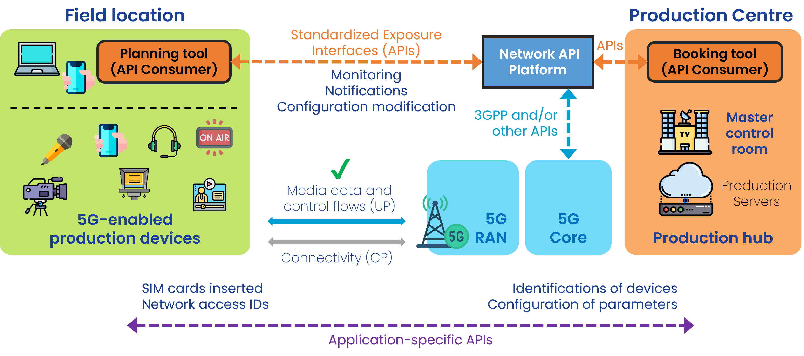

 

{: .warning }
This documentation is currently **under development and subject to change**. It reflects outcomes elaborated by 5G-MAG members. If you are interested in becoming a member of the 5G-MAG and actively participating in shaping this work, please contact the [Project Office](https://www.5g-mag.com/contact)

# Workflows and Requirements in the context of Content Production & Contribution

The [Scenarios and Use Cases](../Production_Contribution_Scenarios.html) page identified two reference scenarios. The workflows in relation to the booking and usage of network capabilities are described here with a focus on quality of service (QoS).

## Pre-conditions and commonalities

Before using any of the APIs, there is typically an agreement established between API customer and API provider. This agreement typically contains information about the API usage conditions, roles and responsibilities, etc. There are different technical ways to establish such an agreement (e.g. personal interactions, or API transactions) and the establishment of the agreement is out of scope for API specification within this working group. See Dedicated Network’s High Level description (link) as example.

The API may support different business and payment models, which are not in scope for the API definition. Before using any API, it is assumed that the payment models are clarified and agreed between the API customer and API provider. This agreement may also clarify, how payment is related to reservations, cancelation of reservations, connectivity usage, etc.   

Before Dedicated Network APIs can be invoked, relevant agreements need to be in place between the API Consumer and the API Provider. Conceptually, the agreement contains all the different terms and conditions, which typically include price, service descriptions and conditions. It also includes obligations and restrictions possibly for both, the API Provider and the API Consumer, etc.

An API Provider may provide a catalog where API Consumers can get an overview of the various options available. For example, there may be a catalog of available APIs, and a catalog of available parameter sets for each of the APIs.

The API Provider may also offer a procedure for requesting additional customization, for example, additional Service Areas or Network Profiles. Such a procedure can leverage conventional methods such as emails or phone conversations.

API Consumers selects from available Network Profiles and Service Areas offered by the API Provider which then become part of the agreed terms and conditions.

This preparation phase is outside the scope of the Dedicated Network APIs.

As result of the agreement on the terms and conditions, the following aspects are determined

URLs and credentials for the API Consumer to use

A set of capabilities and performance targets (Network Profiles) that an API Consumer is eligible to use

A set of geographic areas (Service Areas) that an API Consumer is eligible to use

The API Consumer is aware about the terms and conditions (incl price), when selecting different parameter or parameter combinations according to the conditions.

Note that, at completion of the pre-requisites, no network connectivity resources are reserved, i.e., no Dedicated Network is created.

* The production crew has a set of credentials (SIM/eSIM) for the network device nodes will connect to.
* By default, the network provides "best-effort" connectivity.
* Production device nodes can already exploit "best-effort" connectivity.

* The production company has set up an agreement with a network operator for usage of certain **network capabilitues** (e.g. selected from an API catalogue) and has received authentication credentials from the newotk operator authorising their use (when available).
* The production crew (on location or located in the production centre) has access to one or several **Network API Platforms**. These platforms are accessible through any device/connectivity (e.g. Internet-acccessible website portal, command line tools, dedicated application, etc.).
  * Note: For Network API Platform access, the production crew has obtained key access tokens/keys/credentials/payment details in advance.

# Single Camera Live Video Production (Mobile journalism (MoJo) and newsgathering / Uplink video)

## Before the Event

### Phase A: Preparing devices, configuring application clients and servers, and configuring client/server flows

* Production device nodes are generally UEs which establish connectivity to servers in the Data Network. 
* An **application-specific API** (e.g. from the media equipment provider) enables client/server communication to configure media-related parameters and procedures.
 
### Phase B: Event planning and pre-booking

Through the Network API Platform:
1. The production crew (already on location or while traveling to the event) can discover the capabilities the network can offer in a particular location and at a particular time (for which the production company is eligible for). Example: QoD available, connectivity monitoring available.
2. The production crew requests network services for the devices (identified by its SIM cards) in advance. The booking of resources is done based on:
  * Geographical area
  * Schedule (starting time and closing time, or duration, of the event)
3. The production manager receives a booking reference responding to the service request.
4. The production manager accepts the service booking offer (involving payment).
5. The production manager receives **network access IDs** to be used by the production device UEs to access the network and the requested capabilities for the specified location and duration.
    * Each network access ID ultimately resolves to a Data Network Name (DNN) and optionally a network slice identifier (S-NSSAI).
 
## During the event

### Phase C: Usage of the network capabilities
1. The production crew arrives at the event and can start using the booked network services (See phase B).
2. The production device makes use of the network capabilities according to the network access IDs reveived. The media related parameters can be adapted using an application-specific API, citing the network access IDs delivered in step B.5). For example, considering a camera for which  one video + one audio is pre-booked, the application-specific API is used to properly configure the bitrate of the audio and video output.
 
### Independent steps that can be triggered during the event
* The production crew can use the Network API Platform to monitor that the flows are coming and are properly using the reserved resource.
* The production crew receives notification through the Network API Platform indicating potential issues (throughput, delay, etc.).
 
## After the event

### Phase D: Location teardown
1. Through the Network API Platform, the production crew releases the booked resources when the event finishes.

---

# Multi-device connectivity (Outside Broadcast / Remote Production)

## Before the Event

### Phase A: Preparing devices, configuring application clients and servers, and configuring client/server flows

* Some production device nodes are UEs; others are connected to the Data Network:
  * Example production device nodes connected to the RAN: wireless cameras, wireless camaera control units, wireless microphones, wireless talkback intercom, etc.
  * Example production device nodes connected to the Data Network: vision mixer, sound mixer, etc. 
* An **application-specific API** (e.g. from the media equipment provider) enables communication between the production network orchestrator and the production device nodes to configure media-related parameters and procedures.

### Phase B: Event planning and pre-booking

Through the Network API Platform:
1. The production crew (on location or from the production centre) can discover the capabilities the network can offer in a particular location and at a particular time (for which the production company is eligible for). Example: QoD available, connectivity monitoring available, Timing as a service available, edge compute instantiation, etc.

2. The production crew requests network services for the devices (identified by its SIM cards) in advance. Possible services (network capabilities) are:
   1. *Quality-on-Demand*
      * One or several QoS profiles for each SIM card (QoS profiles are mapped to 5QIs) 
      * Example: A sim may be pre booked for one uplink video / one uplink audio / one downlink data / etc.
   2. *Time-as-a-service*
      * Provided either by access stratum or Precision Time Protocol (PTP).
  
   The booking of resources is done based on:
      * Geographical area
      * Schedule (starting time and closing time, or duration, of the event)
3. The production manager receives a booking reference responding to the service request.
4. The production manager accepts the service booking offer (involving payment/contract/SLA aspects).
5. The production manager receives **network access IDs** to be used by the production device UEs to access the network and the requested capabilities for the specified location and duration.
    * Each network access ID ultimately resolves to a Data Network Name (DNN) and optionally a network slice identifier (S-NSSAI).

## During the event

### Phase C: Location setup and configuration
1. The production crew arrives in the venue, plugs the SIM cards and turn on the devices, connectivity is enabled based on the booked network services (See phase B).
2. The production crew initiates the setup of the location production by interacting with the production network orchestrator.
3. The production network orchestrator configures the production device nodes using an application-specific API, citing the network access IDs delivered in step B.5).

   * Example: QoD service: A camera for which  one video + one audio is pre-booked. The application-specific API is used to properly configure the bitrate of the audio and video output, and the provided IDs.
   * Example: Time Sync service: A camera for which access to global clock is requested. The application-specific API is used to properly configure the time parameters and the provided IDs.
 
### Independent steps that can be triggered during the event
* The production crew can use the Network API Platform to monitor that the flows are coming and are properly using the reserved resource.
* The production crew receives notification through the Network API Platform indicating potential issues (throughput, delay, etc.).
* The production crew through the Network API Platform can request a change of the current configuration.
* Same validation steps as from B.2 to B.5 will be conducted after requesting the change.
* Changes can be, for example:
  * Switch profile A from SIM card A to SIM card B.
  * Increase or decrease the capacity of an existing profile.
  * Remove or add a profile to a SIM card.
  * Enable/Disable time service on a SIM card.
  * etc.

Note: Network access IDs are not expected to change when a reconfiguration occurs.

Note: the steps in phase C are repeated whenever a service is added and created from scratch.
 
## After the event

### Phase D: Location teardown
1. Through the Network API Platform, the production crew releases the booked resources when the event finishes.

# Requirements

## Media delivery with Quality of Service (QoS)

Requirement | API  
-- | --
Ability to request different QoS profiles for individual data flows coming from the same production device node |
Ability to separate media/data flows coming from the same production device node |
Delivery to endpoint (Application Media Server) may be identified by security/protocol/IP/port |
Ability to configure new or re-configure existing QoS profiles to be selected during runtime |
Ability to select at runtime a QoS profile for a media flow |
Ability to receive ACK (success/fail) |

## Information monitoring, logging and/or Network assistance

Requirement | API
-- | --
Ability to receive information from the network |
Real-time information for QoS profile re-selection and/or e.g. codec reconfiguration, bitrate reconfiguration |
Information during runtime for troubleshooting |
Information after the session (logging information) for post-processing |

## Time Synchronization

Requirement | API  
-- | --
Ability to enable distribution of timing information | 

### Voice service for Intercom

Requirement | API 
-- | --
Ability to establish a voice service across the intercom devices deployed at the production location or between the production center and the production location | 

{: .note}
Focus on the QoS for Intercom - a voice service offered by the network may not be so relevant (alternative solutions, WebRTC). But multicast, MCPTT may be of use.

# Considerations on Devices

## Identification of devices
Requirement | API 
-- | --
Devices should be uniquely identifiable during operation |
Devices should be dynamically added or deleted during operation and attachable to given network capabilities |
Each device should only access the network capabilities which have been assigned during booking |

## Device on-boarding and API consumer on-boarding
Requirement | API 
-- | --
TBD How to obtain credentials |

## Discovery of network capabilities
Requirement | API 
-- | --
TBD How to discover network capabilities |
