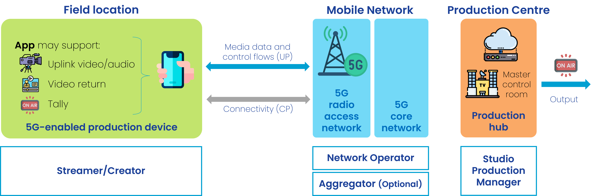

 

{: .warning }
This documentation is currently **under development and subject to change**. It reflects outcomes elaborated by 5G-MAG members. If you are interested in becoming a member of the 5G-MAG and actively participating in shaping this work, please contact the [Project Office](https://www.5g-mag.com/contact)

1. TOC
{:toc}

# Workflows and Requirements to exploit network capabilities for Content Production & Contribution

## Single device connectivity (Mobile journalism (MoJo) and newsgathering / Uplink video)

A journalist in the field or at a venue is capturing and contributing (uplinking) content to an application server located in the cloud or remote premises.
The content is delivered using one of the following options:

  - A **single UE (e.g. a smartphone)** equipped with a single SIM card (or eSIM) connected to the mobile network.

  - A **single device (e.g. a smartphone) equipped with 2 UEs** each with 1 SIM card (or eSIM) connected to a different carrier of the same mobile network or different mobile networks. Note that multi-SIM devices enable users to utilize multiple cellular connections simultaneously. Dual-SIM Dual-Active (DSDA) enable this use case with two SIM cards. This is different to Dual-SIM Dual-Standby (DSDS), which allows only one SIM to stay connected with active data at a time. DSDA enhances data performance for end users by enabling the use of two data connections concurrently across SIM1 and SIM2, with the option to choose the best of them or aggregate both, if necessary, to reach higher data throughput.

  - A **device with multiple UEs (e.g. a cellular bonding backpack)** equipment with multiple SIM cards each one connected to a different carrier of the same mobile network or connected to different mobile networks.

The actors involved are:
  - **Streamer/Creator**, uses the content acquisition equipment to capture media, uses the network and sends data to the server.
  -	a **Studio Production Manager**, located e.g. within the production centre.
  -	**Network Operator**, provides the network used for the production. A set of network capabilities can be configured through APIs (referred to as Network APIs in the following).
  -	**Aggregator (optional)**, provides access to the network capabilties of different Network Operators. See [GSMA Open Gateway](https://www.gsma.com/solutions-and-impact/gsma-open-gateway/) and [GSMA Operator Platform](https://www.gsma.com/solutions-and-impact/technologies/networks/operator-platform-hp/) as examples.

The network functions and applications involved are:
  -	**Production Device** (such as a smartphone or a camera attached which is connected to a modem or a backpack), used by the streamer/creator. The device contains at least one UE with a Subscription (SIM) and can host one or more client applications. A client application can be a video capturing and encoding application, which generates and sends a continuous video stream to a receiving Media Server. 
  -	**Network API Platform**, used by the Network Operator for exposing network Capabilities. The Network API Platform offers a collection of functions e.g. for Authentication / Authorization of the API Invoker (AuthZ Function) and different API Provider functions for different network capabilities. Beside this, there may be more functions, e.g. for API usage metering, API usage throttling, etc.
  -	**Aggregator API Platform (optional)**, located in the path between the Network API Platforms and the API Invoker. It grants access to Network API Platforms from different Network Providers. 
  -	**API Consumer / Invoker**, used by the Production equipment (functions) to interact with the Network API Platform of a Network Provider.    
  -	**Media Servers**, typically located in the Studio Production Hub (operated by the Production Manager) and interact with the production devices, e.g. receiving video or audio streams.

## Multi-device connectivity (Outside Broadcast / Remote Production)

A production crew deployed in the field or at a venue is covering an event using multiple devices including cameras, audio equipment, intercom, etc. Multiple devices are concurrently used during the production. Not all data flows have the same priority and quality requirements. Therefore, each device and data flow should get the requested connectivity performance (e.g. throughput, latency, jitter,...) and with the desired QoS, which may change for each device and data flow during the production.
Two options are considered when it comes to network deployment:

- A network deployed in the field or at a venue that is used to connect devices and manage the production locally. Devices capturing and contributing (uplinking) content deliver it to an application server located in the cloud or in the field location. The final program output may be generated locally and delivered to the production centre using one of the options described in the "newsgathering and mobile journalism" scenario, for instance, by means of a device connected to a mobile network. The scenario may involve the deloyment of different networks:
    - An SNPN, deployed locally. Remote connectivity can be provided by means of a fiber connection or a public network (PNI-NPN) to which the SNPN is connected to. However, the networks are detached and traffic from devices is not directly contributed but only the program output.
    - A PNI-NPN which provides dedicated connectivity locally and for the production devices.

- A public network to which devices are connected to. Devices are managed remotely and are contributing data to the production centre. In this case, a PNI-NPN may be used to guarantee QoS for the different flows carried across the mobile network.

The actors involved are:
  -	A **Production Manager**, deals with the configuration of the production equipment and the access network and has the authority to use the application that interacts with the network operator. It is either: 
    -	a Location Production Manager, who is together with the Production Crew in the field, or
    -	a Studio Production Manager, who is located e.g. within the production centre.

  - **Streamer/Creator/Crew**, uses the content acquisition equipment to capture media and the network to send data to the server.
  -	**Network Operator**, provides the network used for the production. A set of network capabilities can be configured through APIs (referred to as Network APIs in the following).
  -	**Aggregator (optional)**, provides access to the network capabilties of different Network Operators. See [GSMA Open Gateway](https://www.gsma.com/solutions-and-impact/gsma-open-gateway/) and [GSMA Operator Platform](https://www.gsma.com/solutions-and-impact/technologies/networks/operator-platform-hp/) as examples.

The network functions and applications involved are:
  -	**Production Devices** (such as a Camera), used by the crew during a production. Each device contains at least one UE with a Subscription (SIM) and can host one or more client applications. A client application can be a video capturing and encoding application, which generates and sends a continuous video stream to a receiving Media Server. 
  -	**Network API Platform**, used by the Network Operator for exposing network Capabilities. The Network API Platform offers a collection of functions e.g. for Authentication / Authorization of the API Invoker (AuthZ Function) and different API Provider functions for different network capabilities. Beside this, there may be more functions, e.g. for API usage metering, API usage throttling, etc.
  -	**Aggregator API Platform (optional)**, located in the path between the Network API Platforms and the API Invoker. It grants access to Network API Platforms from different Network Providers. 
  -	**API Consumer / Invoker**, used by the Production equipment (functions) to interact with the Network API Platform of a Network Provider.    
  -	**Media Servers**, typically located in the Studio Production Hub (operated by the Production Manager) and interact with the production devices, e.g. receiving video or audio streams.

# Interactions to exploit network capabilities

## Pre-conditions

* The production company has set up an agreement with a network operator for usage of certain **network capabilitues** (e.g. selected from an API catalogue) and has received authentication credentials from the newotk operator authorising their use (when available).
* The production crew (on location or located in the production centre) has access to one or several **Network API Platforms**. These platforms are accessible through any device/connectivity (e.g. Internet-acccessible website portal, command line tools, dedicated application, etc.).
  * Note: For Network API Platform access, the production crew has obtained key access tokens/keys/credentials/payment details in advance.
* The production crew has a set of credentials (SIM/eSIM) for the network the production device nodes will connect to.
* By default, the network provides "best efforts" connectivity.
* Production device nodes already have working "best efforts" connectivity to the network.
 
## Before the Event

### Phase A: Preparing devices, configuring application clients and servers, and configuring client/server flows

* Some production device nodes are UEs; others are connected to the Data Network:
  * Example production device nodes connected to the RAN: wireless cameras, wireless camaera control units, wireless microphones, wireless talkback intercom, etc.
  * Example production device nodes connected to the Data Network: vision mixer, sound mixer, etc. 
* An **application-specific API** enables communication between the production network orchestrator and the production device nodes.
 
### Phase B: Event planning and pre-booking

1. Through the Network API Platform, the production crew (on location or located in the production centre) can discover the capabilities the network can offer in a particular location and at a particular time (for which the production company is eligible for).
   * Example: QoD available, connectivity monitoring available, Timing as a service available, edge compute instantiation, etc.
2. Through the Network API Platform, the production crew requests network services for each of the planned SIM cards in advance. Possible services (network capabilities) are:
   1. *Quality-on-Demand*
      * One or several QoS profiles for each SIM card (QoS profiles are mapped to 5QIs) 
      * Example: A sim may be pre booked for One uplink video / One uplink audio / one downlink data / etc.
   2. *Time-as-a-service*
      * Provided either by access stratum or Precision Time Protocol (PTP).

Note: Booking is done based on:
 * Geographical area
 * Schedule (starting time and closing time of the event)

3. Through the Network API Platform the production manager receives a booking reference responding to the service request.
4. Through the Network API Platform the production manager accepts the service booking offer (involving payment/contract/SLA aspects).
5. Through the Network API Platform the production manager receives **network access IDs** to be used by the production device UEs to access the network on location.
    * Each network access ID ultimately resolves to a Data Network Name (DNN) and optionally a network slice identifier (S-NSSAI).
6. The production crew is responsible for inserting the right SIM card into the right production device UE.
    * Additional configuration of the network access ID may also be required (e.g. by using OMA-DM).
 
## During the event

### Phase C: Location setup and configuration
1. Production crew arrives in the venue, plugs the SIM cards and turn on the devices, connectivity is enabled based on the booked network services (See phase B).
2. The production crew initiates the setup of the location production by interacting with the production network orchestrator.
3. The production network orchestrator configures the production device nodes using an application-specific API, citing the network access IDs delivered in step B.5).

   * Example: QoD service: A camera for which  one video + one audio is pre-booked. The application-specific API is used to properly configure the bitrate of the audio and video output, and the provided IDs.
   * Example: Time Sync service: A camera for which access to global clock is requested. The application-specific API is used to properly configure the time parameters and the provided IDs.
 
### Independent steps that can be triggered during the event
* The production crew can use the Network API Platform to monitor that the flows are coming and are properly using the reserved resource.
* The production crew receives notification through the Network API Platform indicating potential issues (throughput, delay, etc.).
* The production crew through the Network API Platform can request a change of the current configuration.
* Same validation steps as from B.2 to B.5 will be conducted after requesting the change.
* Changes can be, for example:
  * Switch profile A from SIM card A to SIM card B.
  * Increase or decrease the capacity of an existing profile.
  * Remove or add a profile to a SIM card.
  * Enable/Disable time service on a SIM card.
  * etc.

Note: Network access IDs are not expected to change when a reconfiguration occurs.

Note: the steps in phase C are repeated whenever a service is added and created from scratch.
 
## After the event
### Phase D: Location teardown
1. Through the Network API Platform, the production crew releases the booked resources.

# Requirements

## Media delivery with Quality of Service (QoS)

Requirement | API  
-- | --
Ability to request different QoS profiles for individual data flows coming from the same production device node |
Ability to separate media/data flows coming from the same production device node |
Delivery to endpoint (Application Media Server) may be identified by security/protocol/IP/port |
Ability to configure new or re-configure existing QoS profiles to be selected during runtime |
Ability to select at runtime a QoS profile for a media flow |
Ability to receive ACK (success/fail) |

## Information monitoring, logging and/or Network assistance

Requirement | API
-- | --
Ability to receive information from the network |
Real-time information for QoS profile re-selection and/or e.g. codec reconfiguration, bitrate reconfiguration |
Information during runtime for troubleshooting |
Information after the session (logging information) for post-processing |

## Time Synchronization

Requirement | API  
-- | --
Ability to enable distribution of timing information | 

### Voice service for Intercom

Requirement | API 
-- | --
Ability to establish a voice service across the intercom devices deployed at the production location or between the production center and the production location | 

{: .note}
Focus on the QoS for Intercom - a voice service offered by the network may not be so relevant (alternative solutions, WebRTC). But multicast, MCPTT may be of use.

# Considerations on Devices

## Identification of devices
Requirement | API 
-- | --
Devices should be uniquely identifiable during operation |
Devices should be dynamically added or deleted during operation and attachable to given network capabilities |
Each device should only access the network capabilities which have been assigned during booking |

## Device on-boarding and API consumer on-boarding
Requirement | API 
-- | --
TBD How to obtain credentials |

## Discovery of network capabilities
Requirement | API 
-- | --
TBD How to discover network capabilities |
