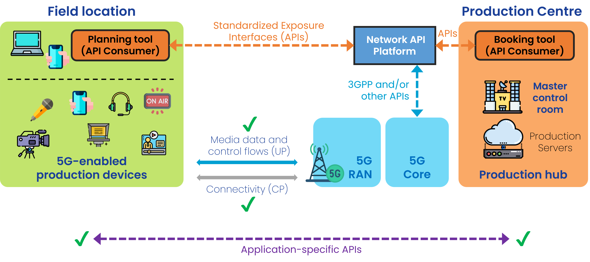
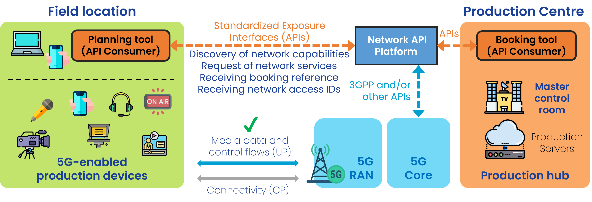
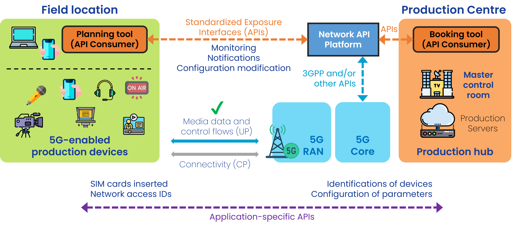

{: .warning }
This documentation is currently **under development and subject to change**. It reflects outcomes elaborated by 5G-MAG members as part of **WI: Network Exposure and APIs Supporting Media Services and Applications**
We welcome and encourage contributions from the broader community. If you are interested in becoming a member of the 5G-MAG and actively participating in shaping this work, please contact the [Project Office](https://www.5g-mag.com/contact)

# Required interactions to exploit network capabilities
  
## Pre-conditions

* The production company has set up an agreement with a network operator for usage of certain **network capabilitues** (e.g. selected from an API catalogue) and has received authentication credentials from the newotk operator authorising their use (when available).
* The production crew (on location or located in the production centre) has access to one or several **Network API Platforms**. These platforms are accessible through any device/connectivity (e.g. Internet-acccessible website portal, command line tools, dedicated application, etc.).
  * Note: For Network API Platform access, the production crew has obtained key access tokens/keys/credentials/payment details in advance.
* The production crew has a set of credentials (SIM/eSIM) for the network the production device nodes will connect to.
* By default, the network provides "best efforts" connectivity.
* Production device nodes already have working "best efforts" connectivity to the network.
 
## Before the Event

### Phase A: Preparing devices, configuring application clients and servers, and configuring client/server flows

* Some production device nodes are UEs; others are connected to the Data Network:
  * Example production device nodes connected to the RAN: wireless cameras, wireless camaera control units, wireless microphones, wireless talkback intercom, etc.
  * Example production device nodes connected to the Data Network: vision mixer, sound mixer, etc. 
* An **application-specific API** enables communication between the production network orchestrator and the production device nodes.
 
### Phase B: Event planning and pre-booking

1. Through the Network API Platform, the production crew (on location or located in the production centre) can discover the capabilities the network can offer in a particular location and at a particular time (for which the production company is eligible for).
   * Example: QoD available, connectivity monitoring available, Timing as a service available, edge compute instantiation, etc.
2. Through the Network API Platform, the production crew requests network services for each of the planned SIM cards in advance. Possible services (network capabilities) are:
   1. *Quality-on-Demand*
      * One or several QoS profiles for each SIM card (QoS profiles are mapped to 5QIs) 
      * Example: A sim may be pre booked for One uplink video / One uplink audio / one downlink data / etc.
   2. *Time-as-a-service*
      * Provided either by access stratum or Precision Time Protocol (PTP).

Note: Booking is done based on:
 * Geographical area
 * Schedule (starting time and closing time of the event)

3. Through the Network API Platform the production manager receives a booking reference responding to the service request.
4. Through the Network API Platform the production manager accepts the service booking offer (involving payment/contract/SLA aspects).
5. Through the Network API Platform the production manager receives **network access IDs** to be used by the production device UEs to access the network on location.
    * Each network access ID ultimately resolves to a Data Network Name (DNN) and optionally a network slice identifier (S-NSSAI).
6. The production crew is responsible for inserting the right SIM card into the right production device UE.
    * Additional configuration of the network access ID may also be required (e.g. by using OMA-DM).
 
## During the event

### Phase C: Location setup and configuration
1. Production crew arrives in the venue, plugs the SIM cards and turn on the devices, connectivity is enabled based on the booked network services (See phase B).
2. The production crew initiates the setup of the location production by interacting with the production network orchestrator.
3. The production network orchestrator configures the production device nodes using an application-specific API, citing the network access IDs delivered in step B.5).

   * Example: QoD service: A camera for which  one video + one audio is pre-booked. The application-specific API is used to properly configure the bitrate of the audio and video output, and the provided IDs.
   * Example: Time Sync service: A camera for which access to global clock is requested. The application-specific API is used to properly configure the time parameters and the provided IDs.
 
### Independent steps that can be triggered during the event
* The production crew can use the Network API Platform to monitor that the flows are coming and are properly using the reserved resource.
* The production crew receives notification through the Network API Platform indicating potential issues (throughput, delay, etc.).
* The production crew through the Network API Platform can request a change of the current configuration.
* Same validation steps as from B.2 to B.5 will be conducted after requesting the change.
* Changes can be, for example:
  * Switch profile A from SIM card A to SIM card B.
  * Increase or decrease the capacity of an existing profile.
  * Remove or add a profile to a SIM card.
  * Enable/Disable time service on a SIM card.
  * etc.

Note: Network access IDs are not expected to change when a reconfiguration occurs.

Note: the steps in phase C are repeated whenever a service is added and created from scratch.
 
## After the event
### Phase D: Location teardown
1. Through the Network API Platform, the production crew releases the booked resources.
