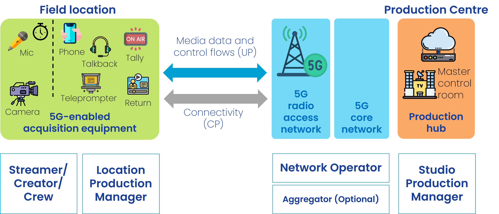
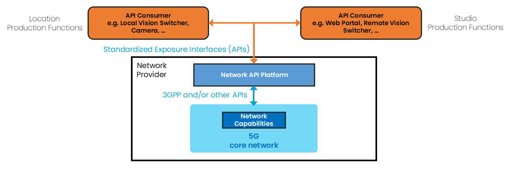
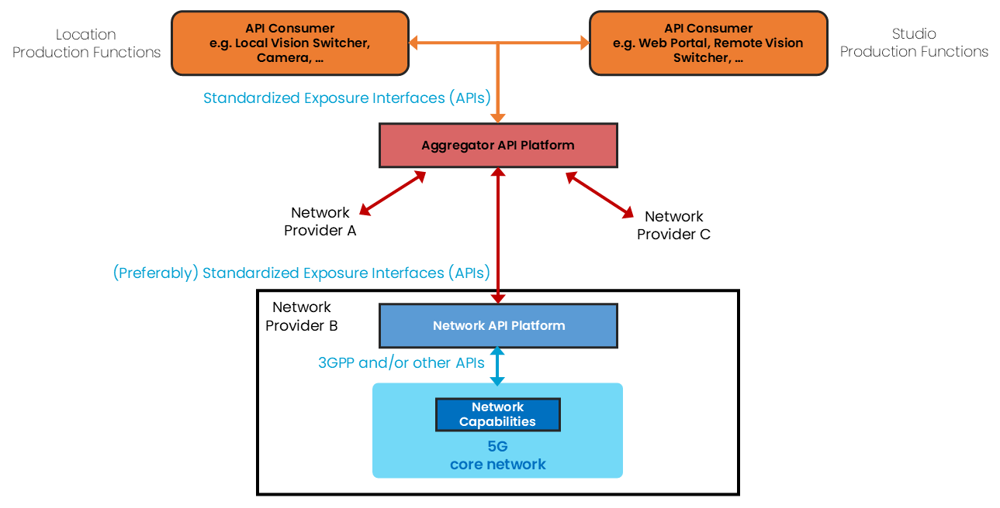

{: .note }
This documentation is currently under development and subject to change. It reflects the ongoing work of 5G-MAG members, as part of **WI: Network Exposure and APIs Supporting Media Services and Applications**
We welcome and encourage contributions from the broader community. If you are interested in becoming a member of the 5G-MAG and actively participating in shaping this work, please contact the [Project Office](https://www.5g-mag.com/contact)

# Network Capability Exposure and APIs for Content Production and Contribution Scenarios
One of the use cases identified in [Towards a comprehensive 5G-based toolbox for live media production](https://www.5g-mag.com/post/towards-a-comprehensive-5g-based-toolbox-for-live-media-production) that may benefit from specific network capabilities beyond best-effort connectivity is professional electronics newsgathering (ENG) or live streaming contribution. The ability of networks to expose capabilities to third-parties and for these to configure and access available network resources may improve the way media traffic is delivered on networks. This document identified a series of requirements, processes and collaboration scenarios related to the exposure of network capabilities to applications.

## Scenario description and actors involved
A production crew deployed in the field or at a venue is capturing and contributing (upstreaming) content to an application server located in the cloud or remote premises.

The actors involved are:
-	Production manager deals with the configuration of the production equipment and the access network and has the authority to use the application that interacts with the network operator. There can be either: 
-	a Location Production Manager, who is together with the Production Crew in the field, or
-	a Studio Production Manager, who is located e.g. within the production centre.
  - Streamer/Creator/Crew, uses the content acquisition equipment to capture media, uses the network and sends data to the server.
-	Network operator, provides the network used for the production. A set of Network Capabilities can be configured through APIs. The set of offered APIs are called Network APIs in the following.
-	Aggregator (optional), provides access to different Network Operators. See [GSMA Open Gateway](https://www.gsma.com/solutions-and-impact/gsma-open-gateway/) and [GSMA Operator Platform](https://www.gsma.com/solutions-and-impact/technologies/networks/operator-platform-hp/). 

Network and Application Functions involved:
-	Production Device (not depicted), used by the crew during a production. Each device contains at least one UE with a Subscription (SIM) and can host one or more client applications. A client application can be a video capturing and encoding application, which generates and sends a continuous video stream to a receiving Media Server. 
-	Network API Platform, used by the Network Operator for exposing Network Capabilities. The Network API Platform offers a collection of functions e.g. for Authentication / Authorization of the API Invoker (AuthZ Function) and different API Provider functions for different network capabilities. Beside this, there may be more functions, e.g. for API usage metering, API usage throttling, etc.
-	Aggregator API Platform (optional) is located in the path between the Network API Platforms and the API Invoker. It grants access to Network API Platforms from different Network Providers. 
-	API Consumer / Invoker, used by the Production equipment (functions) to interact with the Network API Platform of a Network Provider.    
-	Media Servers (not depicted) are typically located in the Studio Production Hub (operated by the Production Manager) and interact with the production devices, e.g. receiving video or audio streams.

## Collaboration scenarios for the provisioning of network capabilities

### Collaboration scenario #1: Direct invoking Network APIs
The Network API Platform of a Network Provider is accessed directly from API Consumers, either deployed with the Studio Production or the Location Production functions. The API consumer can be a Web Portal, e.g. offered by the CSP. Alternatively, the API consumers can be embedded production devices like a Vision Mixer or a production orchestration solution ([NMOS](https://specs.amwa.tv/nmos/branches/main/docs/Technical_Overview.html)  concept). The API consumer functions can be integrated in media servers, responsible for receiving the video stream from the application client.

### Collaboration scenario #2: Invoking Network APIs via an Aggregator
The Network API Platform of a Network Provider is accessed via an Aggregator API Platform. The Aggregator Platforms harmonize capabilities offered by different Network Providers and routes customer requests to them.

