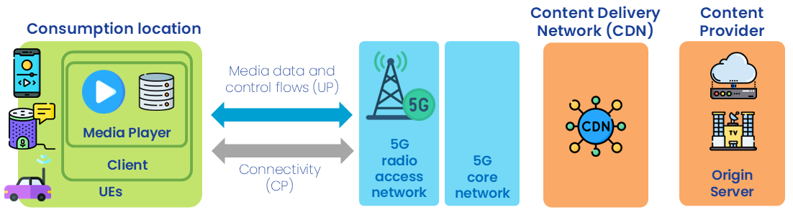

 

{: .warning }
This documentation is currently **under development and subject to change**. It reflects outcomes elaborated by 5G-MAG members. If you are interested in becoming a member of the 5G-MAG and actively participating in shaping this work, please contact the [Project Office](https://www.5g-mag.com/contact)

# Scenarios and Use Cases: Live Media Distribution

## Introduction

Today, video/audio streaming services are delivered over-the-top, i.e. without any defined quality of service (QoS). Measurements of such a service over today's mobile networks indicate that the QoS experienced by viewers and listeners may fall short of their expectations (e.g. interruption-free playback delivered with a delay comparable with linear broadcast radio/television). 

# Reference Scenario

### Actors

The actors involved are:
