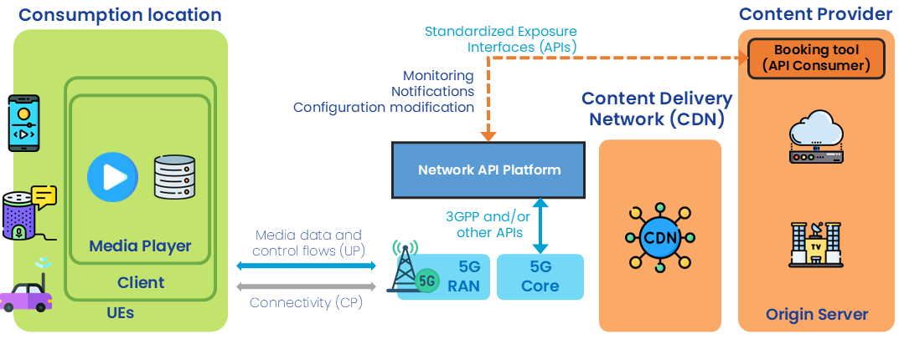

 

{: .warning }
This documentation is currently **under development and subject to change**. It reflects outcomes elaborated by 5G-MAG members. If you are interested in becoming a member of the 5G-MAG and actively participating in shaping this work, please contact the [Project Office](https://www.5g-mag.com/contact)

# Workflows and Requirements for Live Media Production

[Scenarios and Use Cases](../Live_Media_Distribution_Scenarios.html) describe the reference scenario. The workflows in relation to the booking and usage of network capabilities are described here with a focus on quality of service (QoS).

This section contains information on:
* [**Pre-conditions and commonalities**](#pre-conditions-and-commonalities)
...
* [**Requirements**](#requirements)

# Pre-conditions and commonalities

* A content provider wishes to stream live segmented-audio over the internet, including mobile networks, to an application running on UEs (e.g. smartphones, connected cars, etc.).
* The content provider has set up an agreement with a network operator for usage of certain **network capabilitues** made available via an API. The content provider has obtained key access tokens/keys/credentials/payment details in advance authorising their use (when available).
* The content provider has access to one or several **Network API Platforms**. These platforms are accessible through any device/connectivity (e.g. Internet-acccessible website portal, command line tools, dedicated application, etc.).
 
## Before consuming the audio streaming service

### Phase A: Preparing the audio streaming application

* All devices are 3GPP UEs (e.g. smartphones, connected cars, etc.) with a content provider's client application (e.g. radio player app) installed.
 
### Phase B: Network capability pre-booking

1. Through the Network API Platform, the content provider requests network services for the population of client applications in one or more geographical areas. Possible services (network capabilities) are:
   a. *Quality-on-Demand*
      * Provision of reliably low-latency (e.g. latency and interruption-free audio playback similar to conventional broadcast radio).
      * Ability to set quality on demand requirements for a given location
   b. *Geofencing*
      * To verify and/or retrieve the location of a UE or to receive notifications from UEs entering or leaving certain locations/areas (e.g. for determining the content appropriate for the current editorial region).
        
Note: Booking is done based on:
 * Geographical location
 * Schedule

2. Through the Network API Platform the content provider receives a booking reference responding to the service request.
3. Through the Network API Platform the content provider accepts the service booking offer.
4. Through the Network API Platform the content provider receives **network access IDs** to be used by the UEs to access the network capabilities in the corresponding locations.
  * **Is this the way to identify clients/applications?**
 
## While consuming the audio streaming service

### Phase C: Setup and configuration
* The content provider configures its client application with the network access IDs delivered in step B.4.

### Independent steps that can be triggered by the content provider
* The content provider can use the Network API Platform to monitor that the client applications are properly using the requested network capabilities.
* The content provider receives notification through the Network API Platform indicating potential issues (throughput, delay, etc.).
* The content provider through the Network API Platform can request a change of the current configuration. Note that the network access IDs are not expected to change when a reconfiguration occurs.
 
## After having consumed the audio streaming service
### Phase D: Teardown
1. Through the Network API Platform, the content provider releases the booked network capabilities.

# Requirements

## Quality of Service
The following requirements are defined:
- Ability to request different QoS profiles for individual data flows being distributed across a target service area
- Ability to provision QoS profiles for reliable and consistent media segment transfer time on individual data flows to support interruption-free presentation by the media player with minimal buffering.
- Ability to configure new or re-configure existing QoS profiles to be selected during runtime

{: .note }
To be resolved:What does "during runtime" mean? Seems vague. Does it mean during a live media consumption session? I can see that might be applicable in the case of dynamic adaptation by the client, which is common for live video distribution but less common for live audio distribution.
Which party is responsible for the (re)selection of the QoS profiles? Is this intended to be application-driven or network-driven?

- Ability to identify the set of application data flows that fall within the scope of a particular QoS profile treatment

## Information monitoring, logging and/or Network assistance
- Ability to receive information from the network
  - real-time for QoS profile re-configuration

{: .note }
Again, what does real time mean in practice? Too vague at the moment. Maybe "During the course of a media consumption session"?

  - during runtime for troubleshooting 
  - after the session (logging information) for post-processing

## Geofencing
- Ability to verify whether a given UE is currently located inside or outside the target service area.
- Ability to receive notifications when individual UEs enter or leave the target service area.

{: .note }
RB: I don't think there is a need to track the current location of an individual UE on an ongoing basis via a network exposure API because the application running on the UE already has access to that information (with the user's permission).
